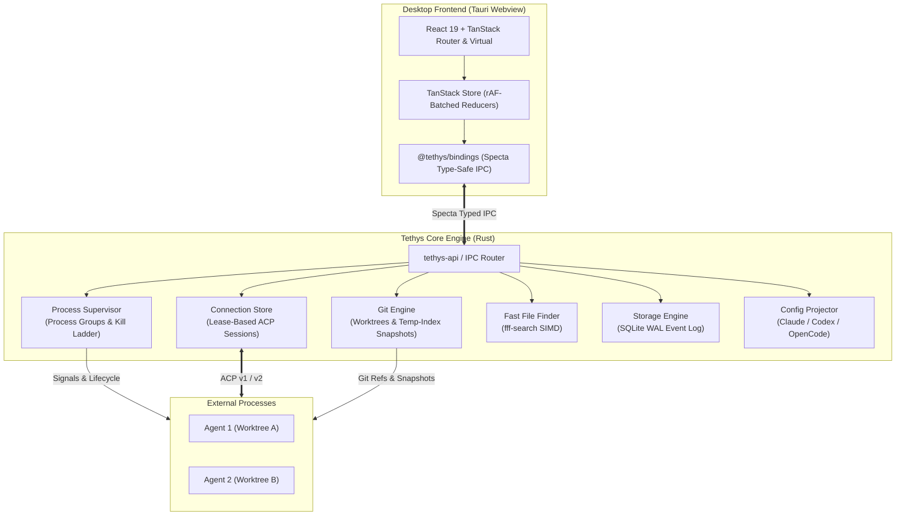

# Tethys

Native, ACP-first desktop workspace for running many coding agents across many repos in parallel.

[](https://turbo.build/repo)
[](https://v2.tauri.app/)
[](https://www.rust-lang.org/)
[](https://nodejs.org/)
[](https://pnpm.io/)

[Overview](#overview) • [Features](#features) • [Architecture](#architecture) • [Validation & Benchmarks](#validation--benchmarks) • [Getting Started](#getting-started) • [Documentation](#documentation)

---

## Overview

Tethys is a lightweight, high-performance desktop application designed to run, supervise, and review autonomous coding agents from any vendor across any number of repositories simultaneously.

Instead of managing multiple disconnected terminals, risking branch collisions, or relying on fragile terminal scrapers, Tethys acts as a robust local control plane. It wraps official agent processes with isolated git worktrees, per-turn diff review and undo, structured permissions, and a synchronized registry for Model Context Protocol (MCP) servers and agent skills.

---

## Features

- **Parallel Worktrees, Zero Collisions**: Write-capable threads execute in dedicated git worktrees by default, preventing agents from dirtying your primary checkout or conflicting with one another.
- **Turn-by-Turn Checkpoints and Instant Rollback**: Temporary-index snapshots capture worktree state before and after every turn in under 150 ms, providing safe undo without polluting git commit history.
- **Protocol-First Agent Integration**: Connects via the standard [Agent Client Protocol (ACP)](https://agentclientprotocol.com/) (v1 and v2) with adapters for leading developer agents (Claude Code, Codex, OpenCode).
- **The Credential Principle**: Vendor subscriptions and credentials are never read, stored, proxied, or reissued. Agents authenticate using their own official login flows and platform keyrings.
- **Unified MCP and Skill Synchronization**: Configure MCP servers and `.agents/skills` centrally. Tethys projects configuration into vendor configs (JSON/TOML) with lossless two-way formatting preservation.
- **Process Group Containment**: Agents run in isolated process groups (`setpgid` on Unix, Job Objects on Windows) governed by an escalating cancellation ladder (`SIGINT` -> grace period -> `SIGTERM` -> `SIGKILL`) to eliminate orphaned background tasks.
- **Sub-Millisecond File Search**: Embedded `fff-search` indexing delivers warm query times under 20 ms across repositories with over 200,000 files for instantaneous `@` references.

> [!IMPORTANT]
> **Vendor Compliance**: Tethys maintains strict adherence to vendor terms of service by ensuring all authentication remains local and delegated directly to official vendor CLIs.

---

## Architecture

Tethys pairs a native Rust core with a lightweight system webview via Tauri v2, maintaining an idle memory footprint under 50 MB while processing millions of events per second.



### Structure

| Package / Crate | Description |
|---|---|
| [`apps/desktop`](./apps/desktop) | Tauri v2 desktop shell with React 19, TanStack Router, and Vite |
| [`crates/tethys-core`](./crates/tethys-core) | Core domain logic and orchestrator: projects, threads, and policies |
| [`crates/tethys-store`](./crates/tethys-store) | SQLite WAL persistence, append-only event log, materialized entries, and BLAKE3 blob store |
| [`crates/tethys-schema`](./crates/tethys-schema) | Wire types and schema definitions exported via Specta |
| [`crates/tethys-api`](./crates/tethys-api) | Typed command router and IPC bridge |
| [`crates/xtask`](./crates/xtask) | Workspace automation tasks (TypeScript bindings generation) |
| [`packages/bindings`](./packages/bindings) | Auto-generated TypeScript types and IPC bindings |
| [`packages/client`](./packages/client) | Typed frontend client wrappers for Tauri commands |
| [`packages/config-ts`](./packages/config-ts) | Shared TypeScript configurations across the workspace |

---

## Validation & Benchmarks

All core infrastructure has been validated against real-world and synthetic workloads during Phase 0:

| Benchmark Area | Milestone Target | Measured Result | Reference |
|---|---|---|---|
| **IPC Throughput** | >= 200k msgs/s | **2,554,645 msgs/s** | [s0.1-ipc-rendering-results.md](./docs/spikes/s0.1-ipc-rendering-results.md) |
| **Diff Virtualization** | 20k-line diff render | **5.24 ms** first paint | [s0.1-ipc-rendering-results.md](./docs/spikes/s0.1-ipc-rendering-results.md) |
| **Git Snapshot (100k files)** | <= 1,000 ms | **122.29 ms** | [s0.4-git-engine-results.md](./docs/spikes/s0.4-git-engine-results.md) |
| **Fuzzy File Search (200k files)** | <= 30 ms warm query | **18.52 ms** | [s0.5-search-results.md](./docs/spikes/s0.5-search-results.md) |
| **Process Containment** | Zero orphaned processes | **0 orphans** after 100 forced kills | [s0.3-supervisor-results.md](./docs/spikes/s0.3-supervisor-results.md) |
| **Event Log Write Throughput** | >= 10k events/s | **304,460 events/s** | [s0.8-footprint-storage-results.md](./docs/spikes/s0.8-footprint-storage-results.md) |

---

## Getting Started

### Prerequisites

- **Rust**: 1.77.2+ (Rust 2021 edition)
- **Node.js**: >= 22 < 23
- **pnpm**: 10.17.0+

> [!TIP]
> On Linux distributions, install the required WebKit2GTK and development libraries before building:
> ```bash
> sudo apt-get install -y libwebkit2gtk-4.1-dev libappindicator3-dev librsvg2-dev patchelf
> ```

### Installation & Development

1. **Clone the repository:**
   ```bash
   git clone https://github.com/Noentic/tethys.git
   cd tethys
   ```

2. **Install frontend dependencies:**
   ```bash
   pnpm install
   ```

3. **Generate type bindings:**
   ```bash
   pnpm run codegen
   ```

4. **Start development desktop app:**
   ```bash
   pnpm run dev
   ```

5. **Run test suites:**
   ```bash
   # Run frontend lint, typecheck, and build checks
   pnpm run typecheck
   pnpm run lint

   # Run core Rust test suite and benchmarks
   cargo test --release --workspace --exclude tethys-desktop
   ```

---

## Documentation

- [Product Requirements Document (PRD)](./docs/prd.md) — Product vision, functional requirements, and persona workflows.
- [Architecture Specification](./docs/architecture.md) — System design, memory targets, IPC protocols, and architectural decisions.
- [Milestone Roadmap](./docs/milestone.md) — Milestone gates, exit criteria, and implementation sequencing.
- [Spike Validation Reports](./docs/spikes/) — In-depth benchmark methodologies and empirical findings.
