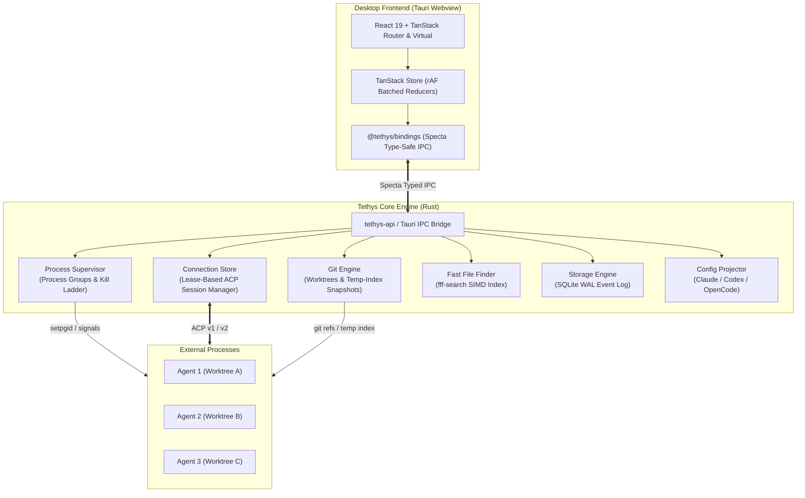

# Tethys

**Native, ACP-first workspace for running many coding agents across many repos in parallel.**

[](https://turbo.build/repo)
[](https://v2.tauri.app/)
[](https://www.rust-lang.org/)
[](#license)

---

## 🌊 Overview

**Tethys** is a lightweight, high-performance desktop application designed to run, supervise, and review autonomous coding agents from any vendor across any number of repositories simultaneously.

Instead of juggling scattered terminals, dealing with dirty checkouts, and risking vendor credential violations, Tethys acts as the orchestrator around your agents: providing isolated git worktrees, per-turn diff review and undo, structured permissions, and a unified registry for Model Context Protocol (MCP) servers and agent skills.

```
┌──────────────┬──────────────────────┬──────────────────────────────────────┐
│ PROJECTS     │ THREADS              │ TURN INSPECTOR                       │
│ hosts > repos│ state, agent, +/-    │ messages · thoughts · plan · tools   │
│ > worktrees  │ filters, search      │ approvals · diffs · restore points   │
├──────────────┴──────────────────────┴──────────────────────────────────────┤
│ ACTION BAR  agent ▾  mode ▾  permissions ▾  worktree  queue  ⏹ Stop        │
│ COMPOSER    /command  $skill  @path …                                      │
└────────────────────────────────────────────────────────────────────────────┘
```

---

## ⚡ Core Philosophy & Differentiators

| Capability | Typical Multi-Agent Desktop Tools | Tethys |
|---|---|---|
| **Agent Integration** | Output scraping or proprietary wrappers | Standard [Agent Client Protocol (ACP)](https://agentclientprotocol.com/); official binaries |
| **Credentials & Auth** | Imported, stored, or proxied | **Never touched**; delegated entirely to vendor native flows |
| **Workspace Isolation** | Shared checkout or manual worktrees | Automated per-thread git worktrees + per-turn rollback checkpoints |
| **Review & Safety** | Coarse git status after the fact | Instant per-turn diffs + undo before or after any turn |
| **MCP & Skills** | Configured per-tool in varying formats | Single committable registry projected into Claude Code, Codex, OpenCode |
| **Desktop Footprint** | Heavy Electron + Node backend | Native Rust core + system webview (idle core $\le 50\text{ MB}$) |

---

## ✨ Key Features

- **Parallel Worktrees, Zero Collisions**: Every agent thread automatically runs in its own dedicated git worktree and branch. Agents never dirty your main working tree or overwrite each other.
- **Per-Turn Checkpoints & Rollback**: Temporary-index snapshots take $< 150\text{ ms}$ even in 100,000-file codebases, creating instant restore points before and after every agent turn without polluting your git commit history.
- **The Credential Principle**: Tethys never reads, stores, proxies, or reissues API keys or OAuth tokens. Agents authenticate directly using their official CLI or login workflows.
- **Unified MCP & Skill Sync**: Configure MCP servers and `.agents/skills` once. Tethys projects them into Claude Code, Codex, and OpenCode config files with lossless two-way formatting round-tripping (`toml_edit`).
- **Deep Supervision & Sandboxing**: Process group containment (`setpgid`) with a graceful cancellation ladder (`SIGINT` $\to$ grace period $\to$ `SIGTERM` $\to$ `SIGKILL`) guarantees zero orphaned processes.
- **Sub-Millisecond File Search**: Embedded `fff-search` provides warm query latency $\le 20\text{ ms}$ over 200,000 files for instantaneous `@` file references in the composer.
- **Three Execution Tiers**:
  - **Class A (ACP-Native)**: Official agent binary speaking ACP directly.
  - **Class B (ACP Adapter)**: Verified adapter translating vendor protocol/SDK into ACP.
  - **Class C (Native Terminal)**: Embedded pseudo-terminal running the vendor's CLI without output interception.

---

## 🏗️ Architecture



### Monorepo Structure

```
tethys/
├── apps/
│   └── desktop/               # Tauri v2 frontend (React, Vite, TanStack Router)
├── crates/
│   ├── tethys-core/           # Domain logic (supervisor, git, ACP, search, storage)
│   ├── tethys-schema/         # Pure Specta wire types & IPC models
│   ├── tethys-api/            # Tauri command & event handlers
│   └── xtask/                 # Development automation (codegen, bindings export)
├── packages/
│   ├── bindings/              # TypeScript bindings generated by specta
│   ├── client/                # Typed frontend IPC client wrappers
│   └── config-ts/             # Shared TypeScript compiler & linter configurations
├── docs/                      # Architectural specs, PRD, milestones, and spike reports
└── fixtures/                  # ACP protocol & projector golden test fixtures
```

---

## 📊 Performance & Validation

All core plumbing was validated in **Phase 0** across real-world synthetic and repository scale tests:

| Area | Milestone Target | Measured Result | Reference |
|---|---|---|---|
| **IPC Throughput** | $\ge 200\text{k msgs/s}$ | **2,554,645 msgs/s** | [s0.1-ipc-rendering-results.md](./docs/spikes/s0.1-ipc-rendering-results.md) |
| **Diff Virtualization** | 20k-line diff render | **5.24 ms** first-paint | [s0.1-ipc-rendering-results.md](./docs/spikes/s0.1-ipc-rendering-results.md) |
| **Git 100k Snapshot** | $\le 1{,}000\text{ ms}$ | **122.29 ms** (temp-index) | [s0.4-git-engine-results.md](./docs/spikes/s0.4-git-engine-results.md) |
| **Warm File Search** | $\le 30\text{ ms}$ on 200k files | **18.52 ms** (`fff-search`) | [s0.5-search-results.md](./docs/spikes/s0.5-search-results.md) |
| **Process Containment**| 0 orphaned processes | **0 orphans** after 100 forced kills | [s0.3-supervisor-results.md](./docs/spikes/s0.3-supervisor-results.md) |
| **Storage WAL Write** | $\ge 10\text{k events/s}$ | **304,460 events/s** | [s0.8-footprint-storage-results.md](./docs/spikes/s0.8-footprint-storage-results.md) |

---

## 🚀 Getting Started

### Prerequisites

- **Rust**: `1.77.2+` (recommended: `1.85+` or latest stable)
- **Node.js**: `>= 22 < 23`
- **pnpm**: `10.17.0+`
- **Platform Dependencies (Linux only)**: WebKit2GTK, libsoup, and build essentials:
  ```bash
  sudo apt-get install -y libwebkit2gtk-4.1-dev libappindicator3-dev librsvg2-dev patchelf
  ```

### Quickstart

1. **Clone the repository:**
   ```bash
   git clone https://github.com/Noentic/tethys.git
   cd tethys
   ```

2. **Install JavaScript dependencies:**
   ```bash
   pnpm install
   ```

3. **Generate TypeScript bindings from Rust schema:**
   ```bash
   pnpm run codegen
   ```

4. **Run development mode:**
   ```bash
   pnpm run dev
   ```

5. **Run test suites:**
   ```bash
   # Frontend tests, lints, and typecheck
   pnpm run typecheck
   pnpm run lint

   # Rust core tests and performance benchmarks
   cargo test --release --workspace --exclude tethys-desktop
   ```

---

## 📖 Documentation

- **[Product Requirements Document (PRD)](./docs/prd.md)**: Product goals, user personas, functional specifications, and compliance model.
- **[Architecture Specification](./docs/architecture.md)**: Technical design, memory layout, IPC serialization, and architectural decisions.
- **[Milestone Roadmap](./docs/milestone.md)**: Milestone-driven delivery plan and exit criteria from Phase 0 to V1.
- **[Spike Results](./docs/spikes/)**: Benchmark measurements and validation reports for IPC, Git, Search, Storage, and ACP protocols.

---

## 📜 License

Licensed under either of:

- Apache License, Version 2.0 ([LICENSE-APACHE](LICENSE-APACHE) or http://www.apache.org/licenses/LICENSE-2.0)
- MIT license ([LICENSE-MIT](LICENSE-MIT) or http://opensource.org/licenses/MIT)

at your option.
