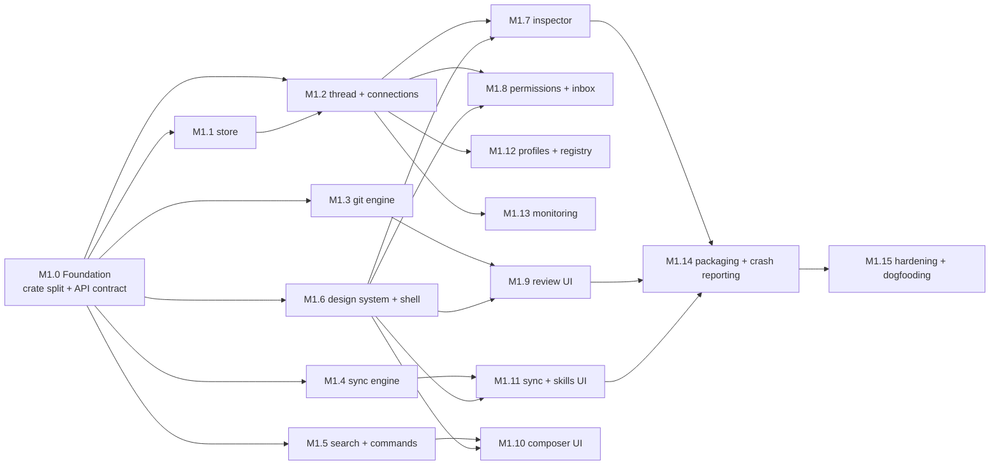
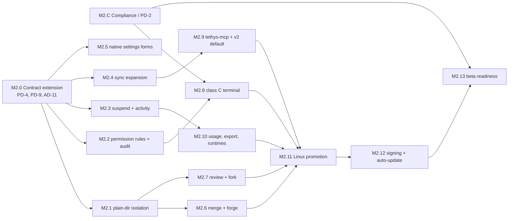

# Tethys — Milestone Roadmap

| Field | Value |
|---|---|
| Status | Draft v0.2 |
| Date | 16 September 2026 |
| Companion docs | [PRD.md](./prd.md) · [ARCHITECTURE.md](./architecture.md) |

Sequencing principle: **prove the risky plumbing first** (IPC, protocol handshakes, process control, git snapshots), then build product surface on top. Progression is milestone-based rather than calendar-based, driven by objective exit criteria and decision gates. Requirement IDs refer to the PRD; PD‑n / AD‑n are the open decisions in each doc.

---

## Overview

| Phase | Goal | Gate |
|---|---|---|
| 0 — Validation | Retire architectural risks | **COMPLETED** (All spike exit criteria met; AD-1, AD-4, AD-5, AD-8, AD-10, AD-13, PD-1 closed) |
| 1 — MVP | Daily‑drivable local app | Team dogfooding validation; all P0 met |
| 2 — V1 | Complete, polished local product | All P1 met; signed builds on all platforms |
| 3 — Beyond | Remote and cross‑agent workflows | Per‑feature |

---

## Phase 0 — Technical Validation (COMPLETED)

Each spike completed with measured exit criteria and written documentation in [`docs/spikes/`](./spikes/).

| Spike | Scope | Exit criteria | Closes | Status / Result Doc |
|---|---|---|---|---|
| S0.0 Repo scaffold | Turborepo + pnpm + Cargo workspace per ARCHITECTURE §3; `codegen` task (specta → `@tethys/bindings`); CI on macOS, Windows, Linux | `turbo run dev` opens the Tauri window; generated types compile; CI green on all three OSes | — | **Done** |
| S0.1 IPC & rendering | Synthetic 8‑stream generator; channels vs events vs binary; TanStack Store reducers with rAF batching; 20 k‑line virtualized diff over git patches | ≥ 5 k small msgs/s at 60 fps and ≤ 50 ms p95 byte‑to‑paint on macOS and Windows; Linux result recorded | AD‑10 | **Done** · [s0.1-ipc-rendering-results.md](./spikes/s0.1-ipc-rendering-results.md) |
| S0.2 ACP v1 + v2 | `agent-client-protocol` 1.x client; v1 adapter and flagged v2 adapter into one event model; three agents (at least one ACP‑native, two adapters); initialize, login, new, prompt, streaming, approval, cancel, resume with replay, close, crash; confirm SDK threading model | All flows pass on v1; v2 flows pass against at least one v2 agent or the SDK's example agent; fixtures recorded for both versions | AD‑4, AD‑8 | **Done** · [s0.2-acp-results.md](./spikes/s0.2-acp-results.md) |
| S0.2b Connection store | Lease‑based ConnectionStore with two‑phase reaping, respawn on transport close, single‑flight session lifecycle (Zed learnings) | No resident idle agents after grace period; dead connection recovers on next use | — | **Done** · [s0.2b-connection-store-results.md](./spikes/s0.2b-connection-store-results.md) |
| S0.3 Supervisor | Process groups / Job Objects, cancel ladder, stderr capture, orphan detection | Zero orphans after 100 forced kills per OS | — | **Done** · [s0.3-supervisor-results.md](./spikes/s0.3-supervisor-results.md) |
| S0.4 Worktrees & restore points | Create/remove, temp‑index snapshots, turn diff, restore; large‑repo benchmark (≥ 100 k files) | Snapshot ≤ 1 s p95 for typical changes | AD‑5 | **Done** · [s0.4-git-engine-results.md](./spikes/s0.4-git-engine-results.md) |
| S0.5 Search | Embed `fff-search`; per‑worktree index | ≤ 30 ms warm query on 200 k files | — | **Done** · [s0.5-search-results.md](./spikes/s0.5-search-results.md) |
| S0.6 Projection | Read/plan/apply/rollback for Claude Code, Codex, OpenCode with golden tests | Round‑trip with no formatting loss | — | **Done** · [s0.6-projection-results.md](./spikes/s0.6-projection-results.md) |
| S0.7 Compliance | Build the vendor compliance matrix with sources | Matrix published internally; plan for PD‑2 agreed | PD‑1 | **Done** · [s0.7-compliance-matrix.md](./spikes/s0.7-compliance-matrix.md) |
| S0.8 Footprint & storage | Measure core/webview memory, startup, installer size; event‑log write/read benchmark | Recorded against targets; targets adjusted if needed | AD‑1, AD‑13 | **Done** · [s0.8-footprint-storage-results.md](./spikes/s0.8-footprint-storage-results.md) |

**Phase 0 must not start product UI work** beyond what the spikes need.

---

## Phase 1 — MVP

### 1.0 Design ownership and handoff gate

The UI design system is user-owned. No product UI implementation should start with placeholder tokens, guessed components, or an invented layout. The user's **full design-system handoff** is the gate for visual implementation, not for backend/API work.

**Design handoff `D0` is complete when it includes:** design tokens (color, type, spacing, radii, elevation, density, motion), light/dark and platform states, typography and icon rules, the four-region shell and responsive/resizable behavior, component variants and interaction states (loading, empty, error, disabled, focused, selected, destructive), accessibility/keyboard rules, and representative specs for the Inspector, approvals/inbox, diff/review, composer, sync/settings, agent profiles, monitoring, onboarding, and terminal surfaces. The handoff must identify which states are rendered by data from the typed API; it does not need to define backend implementation.

> **D0 — ACCEPTED (17 September 2026).** Handoff: [`DESIGN.md`](../DESIGN.md) `d0-rc1` (Semantic Theme Contract: primitives → semantic → `--tethys-*` CSS vars; Default Dark Obsidian Zinc + Default Light Clean Zinc/Slate; JSON-only user themes; Geist icons; four-region shell; state matrix; a11y/keyboard map; all representative surfaces with typed-API bindings). Visual implementation (`M1.6` shell and all design-gated UI chunks below) is now unblocked and must consume `packages/ui` tokens/components without forking variants.

Until `D0` was accepted (accepted 17 September 2026 — the rules below governed pre-acceptance work):

- **Can start in parallel:** M1.0–M1.5 and M2.0/M2.C backend work; persistence, state machines, ACP, process control, git, sync, search, command resolution, API/codegen, fixtures, headless tests, performance tests, compliance research, platform work, and packaging plumbing. The backend portions of M1.7–M1.15 and M2.1–M2.12 may also proceed without visual decisions.
- **Can start only as non-visual infrastructure:** typed frontend clients, state/store reducers, feature contracts, mock data, accessibility test harnesses, markdown/diff/composer parsing, terminal adapters, and notification/update adapters. These worktrees must not choose product styling or screen layout.
- **Blocked until `D0`:** M1.6 design-system/shell implementation and every feature screen, panel, dialog, popup, editor, inspector, grid, settings form, notification surface, onboarding screen, or terminal surface listed below.
- **User owns:** the design files/specification and the visual decisions. Engineering owns translating the accepted handoff into `packages/ui` and the feature packages, wiring typed data and interactions, and reporting gaps against the handoff rather than silently designing around them.

#### Design-gated worktree map

| Phase/chunk | Design-independent portion that can proceed before `D0` | Portion that waits for `D0` |
|---|---|---|
| **M1.6 Design system & shell** | Package scaffolding, token/component contract types, visual regression harness setup | Tokens, components, four-region shell, resizers, command palette, keyboard UX, state chrome — **fully gated and user-owned** |
| **M1.7 Inspector** | Event-to-view models, markdown worker, terminal data adapter, streaming/performance fixtures | Inspector layout, message/thought/plan/tool-call presentation, turn actions, terminal surface |
| **M1.8 Permissions & inbox** | Policy engine, approval protocol, notification adapter, permission tests | Approval dialog, inbox, notification presentation, settings controls |
| **M1.9 Review UI** | Patch parser, diff worker, virtualization and anchor model | Unified/split diff styling, review controls, hunk actions, commit UI |
| **M1.10 Composer** | Command expansion, skill/path resolution, queue persistence and API | Editor, chips, popups, keyboard behavior, queue controls |
| **M1.11 Sync & skills UI** | Registry/projector/rollback engine and trust model | Sync grid, import wizard, skill library, trust and rollback surfaces |
| **M1.12 Profiles & registry** | Registry install/update, launch specs, login delegation and stderr/connection APIs | Agent/profile screens, install flow, login/restart controls |
| **M1.13 Monitoring** | Process sampling, metrics, budget assertions | Activity panel, process rows, restart/suspend controls |
| **M1.14 Packaging/onboarding** | Installer, crash-report scrubbing, update/config plumbing | First-run onboarding and any release-facing UI |
| **M1.15 Hardening** | Backend fault injection, data-loss audit, performance and dogfood instrumentation | End-to-end dogfooding and P0 UI acceptance |
| **M2.1–M2.5** | Isolation, rules/audit, suspension, sync expansion, health checks, native-settings serialization and schemas | Isolation/settings screens, audit UI, activity UI, expanded sync grid, native-settings forms |
| **M2.6–M2.10** | Merge/forge, fork/comment APIs, PTY host, hosted MCP, v2 negotiation, usage/export/runtime services | Merge/review controls, comment UI, fork flow, interactive terminal surface, usage/export views |
| **M2.11–M2.12** | Linux platform fixes, signing, notarization, update manifests and rollback | Cross-platform visual qualification and installer/onboarding acceptance |
| **M2.13 Beta readiness** | Compliance, legal packet, P1 traceability and release automation can be prepared | Final public-beta review is blocked until all design-gated P1 surfaces are implemented and accepted |

**Scheduling rule:** before `D0`, assign worktrees only to the independent portions above. After `D0`, branch the UI chunks from the accepted design-system commit; each UI worktree consumes the same `packages/ui` tokens/components and may not fork its own variants. A backend chunk is complete before `D0` only when it has a typed contract, fixtures, and headless tests; a UI chunk is complete only when it matches the handoff across its specified states and keyboard/accessibility behavior.

**Scope (all P0 in the PRD):**

| Area | Requirements |
|---|---|
| Agents & threads | AGT‑01, 02, 04, 05, 06, 07 |
| Permissions | PRM‑01 to 04 |
| Worktrees & review | WT‑01 to 06 |
| MCP & skills | SYN‑01, 02, 03, 04, 06, 07 |
| Composer | CMP‑01 to 05 |
| Layout | UI‑01 to 04 |
| Monitoring | MON‑01 |

Also in scope: SQLite persistence and resume, opt‑in crash reporting, macOS and Windows installers.

### 1.1 Work chunks and parallelization

Phase 1 is decomposed into 16 chunks organized in four waves. Each chunk is a unit of work sized for one agent in one git worktree, and owns a disjoint set of paths so that concurrent worktrees merge cleanly. Ownership follows the crate/package split in ARCHITECTURE §3: the boundary between chunks *is* the crate boundary.

Wave 0 is the only serial step. It freezes the contract (`tethys-schema` types + `tethys-api` namespaces from §12.1, every method stubbed as `UNIMPLEMENTED`), after which each later chunk replaces stubs inside the crate it owns and nothing else.

#### Wave 0 — contract freeze (serial, 1 worktree) (COMPLETED)

| Chunk | Scope | Owns | Requirements | Exit criteria | Status |
|---|---|---|---|---|---|
| **M1.0** Foundation | Split Phase‑0 `tethys-core` spike modules into the domain crates of §3 (`tethys-thread`, `tethys-acp`, `tethys-agent-servers`, `tethys-supervisor`, `tethys-git`, `tethys-sync`, `tethys-search`, `tethys-store`); declare all §12.1 namespaces in `tethys-api` with typed stubs; scaffold empty TS packages (`state`, `ui`, `features`, `composer`, `diff`, `markdown`, `terminal`); wire `codegen`; per‑crate CI jobs | `Cargo.toml`, all `crates/*` skeletons, `packages/*` skeletons, `turbo.json`, CI | — | `cargo test --workspace` green; `pnpm codegen && pnpm typecheck` green; every §12.1 method callable from the webview and returning `UNIMPLEMENTED`; Phase‑0 spike tests still pass in their new crates | **Done** (17 September 2026) |

#### Wave 1 — domain engines (6 parallel worktrees)

| Chunk | Scope | Owns | Requirements | Exit criteria | Status |
|---|---|---|---|---|---|
| **M1.1** Store & event log | SQLite WAL schema + migrations, append‑only `events`, materialized `entries`, blob store (blake3), `sinceSeq` replay reads | `crates/tethys-store` | AGT‑05 (persistence half) | 10k events/s sustained write; open a 50k‑event thread without full replay; migration round‑trip test; crash‑during‑write leaves no torn state | — |
| **M1.2** Thread & connections | `AgentConnection` trait, `Thread` state machine (UI‑02 states), ConnectionStore leases + two‑phase reaping, supervisor kill ladder, recovery ladder (cancel → force close → resume+replay → restart → Interrupted), session import/resume | `crates/tethys-thread`, `crates/tethys-acp`, `crates/tethys-agent-servers`, `crates/tethys-supervisor` | AGT‑02, 04, 05, 06 | 4 concurrent threads across 2 repos and 2 vendors; kill agent mid‑turn → thread marked *Interrupted* with history intact and resumes on next prompt; zero orphans; ACP v1 + v2 fixture conformance | — |
| **M1.3** Git engine | Worktree create/remove with branch template, untracked‑file copy + setup script, per‑turn temp‑index checkpoints with undoable restore, turn + cumulative diff pipeline, stage/unstage/discard by file and hunk, commit, archive/delete guards | `crates/tethys-git` | WT‑01 to 06 | Checkpoint ≤ 1 s p95 on a 100k‑file repo; restore‑then‑undo‑restore returns identical tree hash; hunk‑level discard fuzz test; delete blocked while uncommitted work exists | **Done** (18 September 2026) · [m1.3-git-engine-results.md](./m1.3-git-engine-results.md) |
| **M1.4** Sync engine | Canonical MCP registry (global + project scope, secrets as keychain refs), session‑start injection, projectors for Claude Code / Codex / OpenCode with plan/apply/rollback + ownership verification + conflict detection, onboarding import, skill library (`.agents/skills`, folder / `.skill` / pinned GitHub), script trust gate | `crates/tethys-sync` | SYN‑01, 02, 03, 04, 06, 07 | Golden round‑trip with zero formatting loss on all three targets; foreign entries never modified; no secret ever written to a config file (assert in test); untrusted script skill excluded from a YOLO thread | — |
| **M1.5** Search & command resolution | Per‑worktree FFF index with invalidation, `search.files` for files *and* folders, `/` command discovery and expansion (project overrides global, `{{args}}` — closes PD‑3), `$` skill injection strategy per agent capability, `@` path reference resolution | `crates/tethys-search`, `crates/tethys-core/src/composer` | CMP‑01, 02, 03, 04 (backend) | ≤ 30 ms warm query on 200k files; index survives worktree churn; expansion golden tests incl. nested `$`/`@` inside command bodies | — |
| **M1.6** Design system & shell | Tokens + shadcn component set, four resizable regions, command palette, full keyboard map, thread‑state chrome, `@tethys/state` rAF‑batched stores against the M1.0 stubs | `packages/ui`, `packages/state`, `apps/desktop/src` shell + layout routes | UI‑01, UI‑02 | Every P0 action reachable by keyboard; axe/a11y clean on the shell; layout stable at 60 fps with a synthetic 8‑stream feed | — |

#### Wave 2 — product surface (6 parallel worktrees)

| Chunk | Scope | Owns | Depends | Requirements | Exit criteria |
|---|---|---|---|---|---|
| **M1.7** Turn Inspector | Streamed messages, collapsible thoughts, live plan, tool calls, per‑turn actions, incremental markdown worker, display‑only terminal | `packages/features/src/inspector`, `packages/markdown`, `packages/terminal` | M1.2, M1.6 | UI‑04 | ≤ 50 ms p95 byte‑to‑paint under the 8‑stream load; 10k‑entry thread scrolls at 60 fps |
| **M1.8** Permissions & inbox | Policy engine (Supervised / Auto‑edit / YOLO), YOLO worktree guard, approval dialogs with remember‑scope, agent‑settings passthrough that policy can narrow but never widen, global "waiting on you" inbox, OS notifications | `crates/tethys-core/src/permission`, `packages/features/src/approvals` | M1.2, M1.6 | PRM‑01 to 04, UI‑03 | Adversarial test: agent mode claims a permission Tethys denies → denied; YOLO refused on a main‑checkout thread without opt‑in; approval round‑trip < 100 ms |
| **M1.9** Review UI | git‑patch parser, virtualized unified + split diff, syntax‑highlight worker, stage/discard interactions, commit box with agent‑drafted message | `packages/diff`, `packages/features/src/review` | M1.3, M1.6 | WT‑04, WT‑05 (UI) | 20k‑line diff first paint ≤ 50 ms; view‑mode switch preserves scroll anchor |
| **M1.10** Composer | `/` `$` `@` editor with chips and popups, agent‑command passthrough and `/agent:name` clash rendering, visible skill‑injection method, editable and reorderable prompt queue | `packages/composer`, `packages/features/src/composer` | M1.5, M1.6 | CMP‑01 to 05 | Popup open‑to‑first‑result ≤ 30 ms; queue survives app restart; paste of a 1 MB prompt does not drop frames |
| **M1.11** Sync & skills UI | Servers × targets grid with *in sync / pending / drifted / conflict / unsupported*, preview‑diff + rollback flow, onboarding import wizard, skill library and trust prompts | `packages/features/src/sync`, `packages/features/src/skills` | M1.4, M1.6 | SYN‑01 to 04, 06, 07 (UI) | Drift injected on disk is detected and rolled back from the UI; trust decision persists and is auditable |
| **M1.12** Agent profiles & registry | Manual profile creation, ACP Registry install with version pinning and opt‑in updates, launch‑spec editing, delegated vendor login (open the vendor's own flow in a terminal), stderr viewer, connection restart | `packages/features/src/agents`, `crates/tethys-agent-servers/src/registry` | M1.2, M1.6 | AGT‑01, AGT‑07 | Install → pin → run a thread end to end for all three vendors; no credential is read, stored, or proxied (audited in test); pinned version survives an upstream release |
| **M1.13** Monitoring | Per‑thread process‑tree CPU/memory sampling, footprint budget assertions in CI | `crates/tethys-core/src/monitor`, `packages/features/src/monitor` | M1.2 | MON‑01 | Sampling overhead < 1% CPU; idle core + webview within ARCHITECTURE §9 targets |

#### Wave 3 — release readiness (serial)

| Chunk | Scope | Owns | Depends | Exit criteria |
|---|---|---|---|---|
| **M1.14** Packaging | macOS and Windows installers, opt‑in crash reporting with scrubbed payloads, first‑run onboarding | `apps/desktop/src-tauri` config, `.github/workflows`, `packages/features/src/onboarding` | Waves 1–2 | Clean‑machine install and launch on both OSes; installer size within §9 target; crash report contains no repo paths, prompts, or secrets |
| **M1.15** Hardening & dogfooding | Perf budget enforcement, fault injection, data‑loss audit, PD‑5 / PD‑6 / PD‑7 / PD‑8 / AD‑9 / AD‑12 resolution write‑ups | `docs/`, cross‑cutting fixes | M1.14 | Phase 1 exit criteria below, met over a sustained dogfooding period |

### 1.2 Parallel worktree protocol

The chunk boundaries only hold if the shared, generated, and lock files are handled by rule rather than by merge:

- **One worktree per chunk**, branched from the merge commit of its dependencies: `git worktree add ../tethys-m1.3 -b feat/m1.3-git-engine`. Share a build cache across worktrees with `CARGO_TARGET_DIR=~/.cache/tethys-target` to avoid rebuilding the workspace per worktree.
- **Generated files are never merged, always regenerated.** `packages/bindings/src/generated/bindings.ts` and the TanStack route tree are marked `linguist-generated` with a `merge=ours` driver; the integrator runs `pnpm codegen` after every merge and the result must be byte‑identical to what CI produces.
- **Schema additions are file‑scoped.** Each chunk adds its types in its own module under `crates/tethys-schema/src/<domain>.rs` and touches `lib.rs` only to add one `pub mod` line.
- **Dependency changes batch into trunk.** A chunk that needs a new crate or npm package opens a lock‑only PR against trunk first; feature branches then rebase. `Cargo.lock` and `pnpm-lock.yaml` conflicts are resolved by regeneration, never by hand.
- **Cross‑chunk needs go through the M1.0 contract.** If a chunk discovers it needs a method it does not own, it adds the stub signature in a trunk PR and consumes the `UNIMPLEMENTED` stub; it never reaches into another chunk's crate.
- **Merge order within a wave is arbitrary by construction.** Any chunk that cannot satisfy that property is mis‑scoped and must be re‑split before work starts.
- **Integration checkpoint at the end of each wave**: full workspace test, codegen determinism check, and the wave's exit criteria re‑run on trunk before the next wave branches.

**Decisions to close during MVP:** PD‑3 (M1.5), PD‑5, PD‑6, PD‑7, PD‑8, AD‑9, AD‑12 (M1.15 write‑ups, decided in the chunk that hits them first).

**Exit criteria:**
- Sustained team dogfooding with ≥ 4 concurrent threads without regressions.
- All P0 requirements met.
- No open data‑loss bugs.
- PRD quality targets met on macOS and Windows.

---

## Phase 2 — V1

| Area | Requirements |
|---|---|
| Agents | AGT‑03 (terminal hosting, confirmed vendors only), AGT‑08 |
| Permissions | PRM‑05, PRM‑06 |
| Worktrees & review | WT‑07 to 11 (incl. plain‑directory `isolation: plain`, PD‑9) |
| MCP & skills | SYN‑05, 08, 09, 10, 11 (native-settings forms for OpenCode, Antigravity CLI, Kiro CLI; community schemas, AD‑14) |
| Composer & layout | CMP‑06, UI‑05 |
| Monitoring | MON‑02 to 04 |

Also in scope:
- Linux promoted to fully supported if it meets the quality targets.
- Signed builds and auto‑update on all platforms.
- Closing PD‑2, PD‑4, PD‑9, AD‑2, AD‑6, AD‑11, and AD‑14.
- Tethys‑hosted MCP server (`tethys-mcp`) and ACP v2 enabled by default if the spec has stabilized.

**Exit criteria:**
- All P1 requirements met.
- Compliance matrix re‑verified within the last 30 days.
- Public beta readiness review passed, including legal review of vendor handling.

### 2.1 Work chunks and parallelization

Phase 2 splits into 15 chunks. The crate layout already exists after Phase 1, so boundaries are now **file‑scoped inside a crate** rather than whole crates: two chunks may work in `tethys-git` or `tethys-sync` at once only if each adds its own modules and touches shared files in append‑only ways. Where that is not achievable the chunks are staged into different waves instead of being run concurrently.

Two chunks gate the rest and start first: the contract extension (M2.0) and vendor compliance confirmation (M2.C), the latter being research and legal work that runs alongside code with no repo conflicts.

#### Wave 0 — contract and clearances (M2.0 serial; M2.C in parallel, non‑code)

| Chunk | Scope | Owns | Closes | Exit criteria |
|---|---|---|---|---|
| **M2.0** Contract extension | Declare the remaining §12.1 surface as typed stubs (`git.merge/push/pr.create`, `agent.config.schema/get/validate/plan/apply/rollback`, `terminal.*`, `permission.rules.*`, `thread.fork`, `mcp.health`); scaffold `crates/tethys-pty` and `crates/tethys-mcp`; settle AD‑11 (client data layer) in `packages/state`; write down PD‑4 (fork behaviour) and PD‑9 (isolation scope and thread root) since both shape three chunks each | `crates/tethys-api`, `crates/tethys-schema` module additions, two new crate skeletons, `packages/state` | AD‑11, PD‑4, PD‑9 | Workspace green; every new method reachable from the webview returning `UNIMPLEMENTED`; PD‑4 and PD‑9 recorded in ARCHITECTURE with the chosen option |
| **M2.C** Compliance & vendor clearance | Per‑vendor determination of whether terminal (Class C) hosting is acceptable, with sources and dates; refresh the S0.7 matrix; assemble the legal review packet on credential and vendor handling | `docs/spikes/s0.7-compliance-matrix.md`, `docs/compliance/` | PD‑2 (final) | Confirmed / rejected / unknown recorded per vendor with a citation; M2.8 ships only the confirmed set; matrix dated within 30 days of the beta review |

#### Wave 1 — foundations that other chunks build on (5 parallel worktrees)

| Chunk | Scope | Owns | Requirements | Exit criteria |
|---|---|---|---|---|
| **M2.1** Plain‑directory isolation | Project‑level `isolation: worktree \| plain` with global default and project override, `GIT_DISABLED` on every `git.*` method, thread creation rooted at the workspace folder, UI kill‑switch messaging about no checkpoints, YOLO opt‑in path for plain workspaces; submodule and Git LFS detection promoted from warning to support | `crates/tethys-git/src/isolation.rs`, `crates/tethys-git/src/submodule.rs`, guard wiring in `tethys-git/src/lib.rs`, `packages/features/src/settings/isolation` | WT‑10, WT‑11 | Every `git.*` method returns `GIT_DISABLED` in a plain workspace (exhaustive test over the namespace); a non‑git folder can run a thread end to end; changing the setting leaves existing worktree threads untouched; LFS pointers and submodules survive a checkpoint/restore cycle |
| **M2.2** Permission rules & audit | Rules by tool type, command pattern, path, and MCP server → allow / ask / reject, with precedence and dry‑run explain; audit log of approvals, file writes, and commands with export | `crates/tethys-core/src/permission/rules.rs`, `crates/tethys-core/src/audit.rs`, `packages/features/src/settings/permissions`, `packages/features/src/audit` | PRM‑05, PRM‑06 | Rule‑precedence table test incl. conflicting patterns; a reject rule cannot be widened by an agent mode or a YOLO thread; export round‑trips and contains no secret values; audit write adds < 1 ms to an approval |
| **M2.3** Suspension & activity panel | Suspend idle threads to free memory and resume on demand (only where the agent supports resume), activity panel over the process tree with state, CPU, memory, uptime, stderr, restart and suspend actions | `crates/tethys-core/src/monitor`, `crates/tethys-supervisor/src/suspend.rs`, `packages/features/src/monitor` | AGT‑08, MON‑02 | Suspending 4 idle threads returns memory to within the §9 idle target; resume restores full history; agents without resume are never suspended; restart from the panel recovers a wedged connection |
| **M2.4** Sync expansion | Projection targets for Claude Desktop, Gemini CLI, Cursor, and Kiro (paths verified) reusing the §11.3 safety path; skills materialized into agent‑specific folders; MCP health check (starts, lists tools, latency); per‑thread disable of any server or skill; local stdio bridge for agents lacking HTTP MCP support | `crates/tethys-sync/src/targets/*`, `crates/tethys-sync/src/health.rs`, `crates/tethys-sync/src/overrides.rs`, `crates/tethys-sync/src/bridge.rs`, `packages/features/src/sync` grid extensions | SYN‑05, 08, 09, 10, AD‑6 | Golden round‑trip with zero formatting loss on all seven targets; health check reports a deliberately broken server without hanging; per‑thread disable takes effect at session start and is visible on the message; bridge survives server restart |
| **M2.5** Native settings forms | Per‑agent form over the whole native config file for OpenCode, Antigravity CLI, and Kiro CLI, from versioned community schemas; raw text fallback; preview diff, backups, rollback, unknown‑key preservation, version‑drift warning and validation‑failure block; links out to official docs for advanced areas | `crates/tethys-sync/src/native_settings/`, `crates/tethys-sync/src/schema_registry.rs`, `packages/features/src/agents/settings` | SYN‑11, AD‑14 | Unknown keys survive a form save byte‑for‑byte; version mismatch warns, schema failure blocks apply until fixed or explicitly applied as raw; secrets remain `${VAR}` / keychain refs (asserted); rollback restores the exact prior file |

#### Wave 2 — product surface (5 parallel worktrees)

| Chunk | Scope | Owns | Depends | Requirements | Exit criteria |
|---|---|---|---|---|---|
| **M2.6** Merge & forge | Merge, squash, and rebase back to base; conflicts handed to an agent as a new turn with conflict context; push and PR via the user's installed `gh` / `glab` | `crates/tethys-git/src/merge.rs`, `crates/tethys-git/src/forge.rs`, `packages/features/src/review/merge` | M2.1 | WT‑07, WT‑08 | All three strategies verified against a conflicting branch; a conflict turn produces a resolvable worktree; no forge token is ever read or stored (asserted); operations are hidden in plain workspaces |
| **M2.7** Review collaboration & fork | Line comments on a diff sent back as a follow‑up, line ranges on `@` tags, fork a thread from any turn per the PD‑4 decision | `packages/diff/src/comments`, `packages/composer/src/ranges`, `crates/tethys-core/src/thread/fork.rs`, `packages/features/src/review/comments` | M2.1 | WT‑09, CMP‑06, UI‑05 | Comment threads map to stable line anchors across a rebase; `@src/auth.rs:40-80` resolves and is echoed on the message; a fork shares no mutable state with its parent and both remain runnable |
| **M2.8** Class C terminal hosting | Interactive PTY host over `portable-pty` rooted at the worktree, reduced `WorkspaceOnlyConnection` so the UI cannot assume protocol features, workspace‑only feature set (worktrees, restore points, diffs, config sync), no output parsing or injection | `crates/tethys-pty`, `packages/terminal/src/interactive`, `packages/features/src/threads/terminal` | M2.C, M2.2 | AGT‑03 | Ships only for vendors confirmed in M2.C; a Class C thread exposes no protocol‑only affordance in the UI; restore points work for it; resize and reflow correct at 200×50 under load; termination leaves zero orphans |
| **M2.9** Hosted MCP & v2 default | `tethys-mcp` over `rmcp` per thread on stdio exposing worktree‑jailed search, request‑checkpoint, open‑in‑editor, and thread metadata, off by default and injected like any other server; flip ACP v2 to default if the spec has stabilized, behind a per‑profile override | `crates/tethys-mcp`, `crates/tethys-acp/src/negotiate.rs` default flip | M2.4 | §7.7 | Jailed search cannot escape the worktree (path‑traversal test suite); server adds < 15 MB RSS per thread; v2‑default regression run passes on all adapters, with a documented rollback to v1 |
| **M2.10** Usage, export & runtimes | Usage and cost surfaced only when the agent reports it, thread export as markdown or event log, npm/Python adapter runtime detection with an optional managed Node/uv path | `crates/tethys-core/src/usage.rs`, `crates/tethys-core/src/export.rs`, `crates/tethys-agent-servers/src/runtime.rs`, `packages/features/src/threads/export` | M2.3 | MON‑03, MON‑04, AD‑2 | No inferred or estimated cost is ever shown; export of a 50k‑event thread completes without blocking the UI and contains no secrets; a machine without Node can still install and run an npm adapter, or fails with an actionable message |

#### Wave 3 — release readiness (serial)

| Chunk | Scope | Owns | Depends | Exit criteria |
|---|---|---|---|---|
| **M2.11** Linux promotion | Run the full PRD quality‑target suite on Linux, close platform gaps (WebKitGTK rendering, keyring, notifications, PTY), promote Linux to fully supported or record why not | `.github/workflows`, platform‑specific modules, `docs/platform-support.md` | Wave 2 | Every PRD quality target met on Linux, or a written exception per miss; CI runs the full suite on Linux, not a subset |
| **M2.12** Signing & auto‑update | Code signing and notarization on macOS, Windows signing, Linux packaging; auto‑update channel with signed manifests and rollback | `apps/desktop/src-tauri` config, release workflows, update server config | M2.11 | Signed artifacts verify on clean machines for all three OSes; update applies and rolls back without data loss; unsigned or tampered manifests are rejected |
| **M2.13** Beta readiness | Compliance matrix re‑verification, legal review sign‑off on vendor and credential handling, P1 requirement audit, open‑bug triage | `docs/` | M2.12, M2.C | Phase 2 exit criteria above met and signed off |

### 2.2 Parallelization notes specific to Phase 2

The Phase 1 worktree protocol (§1.2) applies unchanged. Three additional constraints come from working inside existing crates rather than new ones:

- **In‑crate ownership is by module file.** A chunk adds `crates/<crate>/src/<feature>.rs` and touches `lib.rs` only to add a `pub mod` line. A chunk that needs to edit an existing function body in another chunk's file is mis‑staged; move it to a later wave.
- **M2.1 lands before anything else that touches `tethys-git`.** Adding the `GIT_DISABLED` guard is a broad, shallow edit across every git method, which conflicts with everything. That is why merge and forge work sits in wave 2 despite having no logical dependency on isolation.
- **Wide‑blast‑radius chunks ship behind flags.** The ACP v2 default flip (M2.9) and Linux promotion (M2.11) change behaviour for every thread, so both land disabled, are validated on trunk, and are enabled in a separate one‑line commit that is trivial to revert.
- **No chunk may widen the permission surface on its own.** New capabilities (Class C commands, hosted MCP tools, forge pushes) register with M2.2's rules engine and default to *ask*; a chunk that introduces an always‑allowed path fails review.
- **M2.8 is scope‑gated, not schedule‑gated.** Its vendor list is whatever M2.C confirmed. If M2.C confirms nothing, M2.8 still ships the host with an empty confirmed set rather than being cut, so AGT‑03 becomes a configuration change later.

---

## Phase 3 — Beyond V1 (exploratory)

- **Remote hosts:** `tethysd` with pairing, SSH‑tunnel UX, and a multi‑host explorer (REM‑01).
- **Remote approvals:** an inbox‑first web or mobile companion (REM‑02, AD‑7).
- **Remote agents:** supported once ACP's network transport stabilizes.
- **Cross‑agent workflows:** hand a thread to another agent; "best‑of‑N" attempts in sibling worktrees with a comparison view.
- **Event hooks:** MON‑05.
- **Team‑shared policies.**
- **Optional reference agent:** bring‑your‑own‑API‑key.

---

## Decision Gates

| When | Decisions |
|---|---|
| Already decided | AD‑3 (React + TanStack) |
| Phase 0 (All Closed) | **AD‑1** (documented trigger), **AD‑4** (pooled with leases), **AD‑5** (gix reads + CLI mutations), **AD‑8** (v1+v2 side-by-side, v2-shaped internal model), **AD‑10** (custom virtualized git diffs), **AD‑13** (rusqlite+tokio-rusqlite), **PD‑1** (API key default) |
| During MVP | PD‑3, PD‑5, PD‑6, PD‑7, PD‑8, AD‑9, AD‑12 |
| Before MVP beta | PD‑2 plan confirmed with sources |
| During V1 | PD‑2 (final), PD‑4, PD‑9, AD‑2, AD‑6, AD‑11, AD‑14 |
| Phase 3 | AD‑7 |