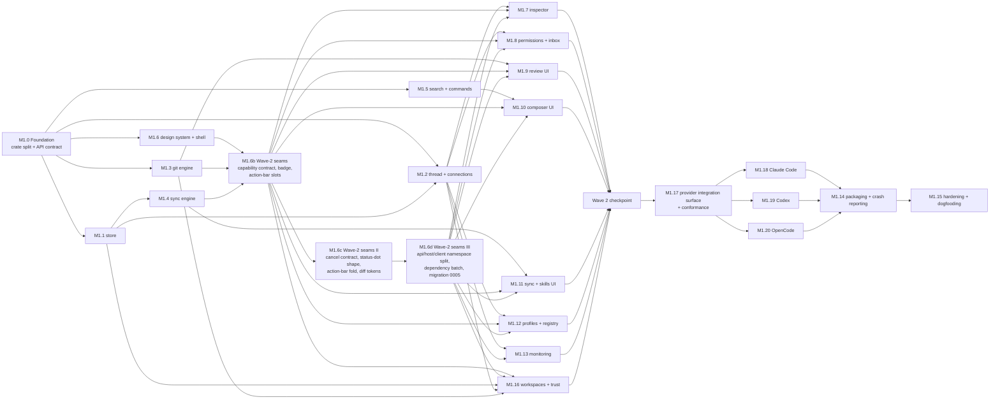
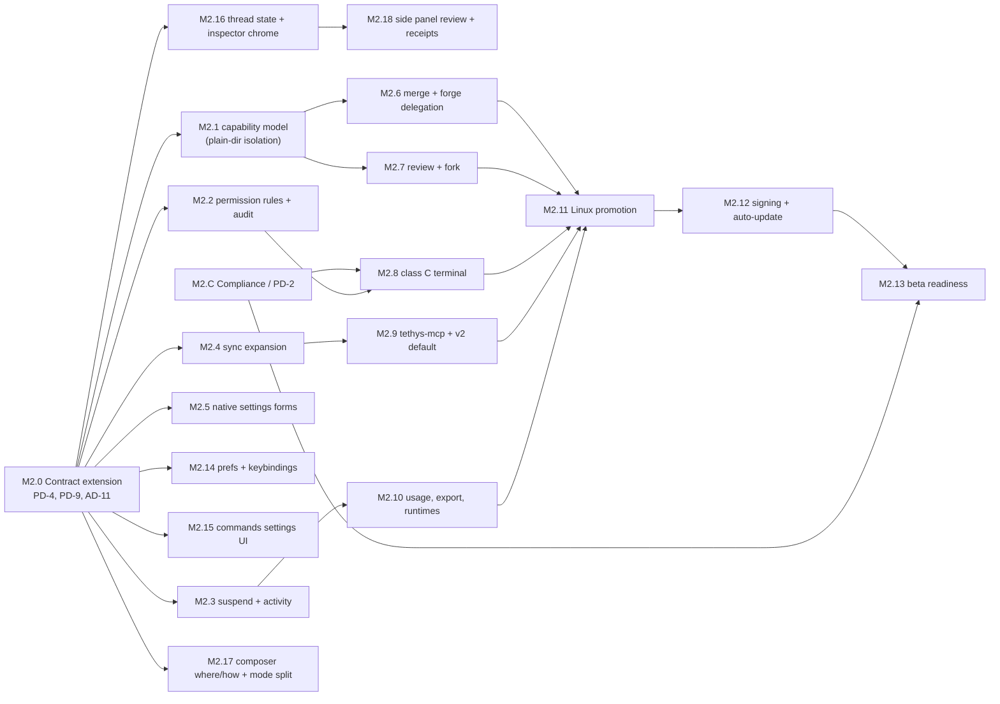

# Tethys — Milestone Roadmap

| Field | Value |
|---|---|
| Status | Draft v0.2 |
| Date | 16 September 2026 |
| Companion docs | [PRD.md](./prd.md) · [ARCHITECTURE.md](./architecture.md) |

Sequencing principle: **prove the risky plumbing first** (IPC, protocol handshakes, process control, git snapshots), then build product surface on top. Progression is milestone-based rather than calendar-based, driven by objective exit criteria and decision gates. Requirement IDs refer to the PRD; PD‑n / AD‑n are the open decisions in each doc.

---

## Overview

| Phase | Goal | Gate |
|---|---|---|
| 0 — Validation | Retire architectural risks | **COMPLETED** (All spike exit criteria met; AD-1, AD-4, AD-5, AD-8, AD-10, AD-13, PD-1 closed) |
| 1 — MVP | Daily‑drivable local app | Team dogfooding validation; all P0 met |
| 2 — V1 | Complete, polished local product | All P1 met; signed builds on all platforms |
| 3 — Beyond | Remote and cross‑agent workflows | Per‑feature |

---

## Phase 0 — Technical Validation (COMPLETED)

Each spike completed with measured exit criteria and written documentation in [`docs/spikes/`](./spikes/).

| Spike | Scope | Exit criteria | Closes | Status / Result Doc |
|---|---|---|---|---|
| S0.0 Repo scaffold | Turborepo + pnpm + Cargo workspace per ARCHITECTURE §3; `codegen` task (specta → `@tethys/bindings`); CI on macOS, Windows, Linux | `turbo run dev` opens the Tauri window; generated types compile; CI green on all three OSes | — | **Done** |
| S0.1 IPC & rendering | Synthetic 8‑stream generator; channels vs events vs binary; TanStack Store reducers with rAF batching; 20 k‑line virtualized diff over git patches | ≥ 5 k small msgs/s at 60 fps and ≤ 50 ms p95 byte‑to‑paint on macOS and Windows; Linux result recorded | AD‑10 | **Done** · [s0.1-ipc-rendering-results.md](./spikes/s0.1-ipc-rendering-results.md) |
| S0.2 ACP v1 + v2 | `agent-client-protocol` 1.x client; v1 adapter and flagged v2 adapter into one event model; three agents (at least one ACP‑native, two adapters); initialize, login, new, prompt, streaming, approval, cancel, resume with replay, close, crash; confirm SDK threading model | All flows pass on v1; v2 flows pass against at least one v2 agent or the SDK's example agent; fixtures recorded for both versions | AD‑4, AD‑8 | **Done** · [s0.2-acp-results.md](./spikes/s0.2-acp-results.md) |
| S0.2b Connection store | Lease‑based ConnectionStore with two‑phase reaping, respawn on transport close, single‑flight session lifecycle (Zed learnings) | No resident idle agents after grace period; dead connection recovers on next use | — | **Done** · [s0.2b-connection-store-results.md](./spikes/s0.2b-connection-store-results.md) |
| S0.3 Supervisor | Process groups / Job Objects, cancel ladder, stderr capture, orphan detection | Zero orphans after 100 forced kills per OS | — | **Done** · [s0.3-supervisor-results.md](./spikes/s0.3-supervisor-results.md) |
| S0.4 Worktrees & restore points | Create/remove, temp‑index snapshots, turn diff, restore; large‑repo benchmark (≥ 100 k files) | Snapshot ≤ 1 s p95 for typical changes | AD‑5 | **Done** · [s0.4-git-engine-results.md](./spikes/s0.4-git-engine-results.md) |
| S0.5 Search | Embed `fff-search`; per‑worktree index | ≤ 30 ms warm query on 200 k files | — | **Done** · [s0.5-search-results.md](./spikes/s0.5-search-results.md) |
| S0.6 Projection | Read/plan/apply/rollback for Claude Code, Codex, OpenCode with golden tests | Round‑trip with no formatting loss | — | **Done** · [s0.6-projection-results.md](./spikes/s0.6-projection-results.md) |
| S0.7 Compliance | Build the vendor compliance matrix with sources | Matrix published internally; plan for PD‑2 agreed | PD‑1 | **Done** · [s0.7-compliance-matrix.md](./spikes/s0.7-compliance-matrix.md) |
| S0.8 Footprint & storage | Measure core/webview memory, startup, installer size; event‑log write/read benchmark | Recorded against targets; targets adjusted if needed | AD‑1, AD‑13 | **Done** · [s0.8-footprint-storage-results.md](./spikes/s0.8-footprint-storage-results.md) |

**Phase 0 must not start product UI work** beyond what the spikes need.

---

## Phase 1 — MVP

### 1.0 Design ownership and handoff gate

The UI design system is user-owned. No product UI implementation should start with placeholder tokens, guessed components, or an invented layout. The user's **full design-system handoff** is the gate for visual implementation, not for backend/API work.

**Design handoff `D0` is complete when it includes:** design tokens (color, type, spacing, radii, elevation, density, motion), light/dark and platform states, typography and icon rules, the four-region shell and responsive/resizable behavior, component variants and interaction states (loading, empty, error, disabled, focused, selected, destructive), accessibility/keyboard rules, and representative specs for the Inspector, approvals/inbox, diff/review, composer, sync/settings, agent profiles, monitoring, onboarding, and terminal surfaces. The handoff must identify which states are rendered by data from the typed API; it does not need to define backend implementation.

> **D0 — ACCEPTED (17 September 2026).** Handoff: [`DESIGN.md`](../DESIGN.md) `d0-rc3` (Semantic Theme Contract: primitives → semantic → `--tethys-*` CSS vars; Default Dark Obsidian Zinc + Default Light Clean Zinc/Slate; JSON-only user themes; Geist icons; four-region shell; state matrix; a11y/keyboard map; all representative surfaces with typed-API bindings), with [`pages-views-spec.md`](./pages-views-spec.md) as its route-level companion (ACP Provider/Workspace/Session model and the four routes `/workspaces`, `/thread/new`, `/thread/:id`, `/settings/*`). `d0-rc2` reconciled the two: it superseded `d0-rc1`'s fixed three-column model selector, its `thread-list-row` / `approval-card` naming, and its vendor-file MCP projection model. Visual implementation (`M1.6` shell and all design-gated UI chunks below) is now unblocked and must consume `packages/ui` tokens/components without forking variants. `d0-rc3` re-homes page layouts and component behaviour into `pages-views-spec.md` and the UI data-bindings table into `architecture.md` §8.3; it changes no visual decision, so this acceptance stands.
>
> **`d0-rc4` — accepted 20 September 2026.** Visual decisions on top of `d0-rc3`: the `awaiting` ring, State Precedence, `stop-control`, action-bar collapse order, `diff-added` / `diff-removed`.
>
> **`d0-rc5` — accepted 20 September 2026.** `sync-grid` matrix and 2-D keyboard model; `stacking` scale (the `Esc` order is derived from it, drawers dismiss last); Inspector overlay mode (the `1100px`–`1512px` gap stays open); provider surfaces; the thread-view completion (`pages-views-spec.md` §4.1); Interaction Patterns and streaming-transcript a11y. Gates M1.7, M1.10, M1.11 and M1.6c's stacking and provider-surface units, which are now unblocked.
>
> **`d0-rc6` — accepted 21 September 2026.** Settings revamp. Skills classify by **scope** (`scope-badge`: Global / Workspace), never category; `category-pill` → `provenance-badge`; new `skill-detail` two-pane viewer, `skill-upload-dialog`, `file-dropzone`. MCP drops the servers × Providers matrix: `sync-grid` / `sync-grid-cell` are **deprecated**, replaced by the per-Provider `provider-tab` + `config-file-row` + `code-editor-well` (JSON / JSONC / TOML) + `mcp-server-form` editor (`pages-views-spec.md` §5.4, `architecture.md` AD‑16 / §11.6). Supersedes M1.11's matrix surface (M1.11 remains Done on the M1.4 engine; its `sync-grid` UI is revised by this revision).
>
> **`d0-rc7` — accepted 21 September 2026.** Commands management joins Skills on Settings / Skills & Commands: new `command-row`, `args-tag`, `command-editor`; `code-editor-well` gains a `Markdown` mode; `provenance-badge` gains command values. Commands classify by **scope** only, like skills; agent-advertised `/agent:*` commands stay composer-only (`pages-views-spec.md` §5.3, `CMP‑07`). Gates the new **M2.15** chunk.
>
> **`d0-rc8` — accepted 21 September 2026.** Light-mode wells. `surface-sunken` stops being dark in Default Light — terminal, code and diff wells recess with `slate-200`, so light mode has no black blocks. `diff-added` / `diff-removed` gain a deeper light pair (`green-700` / `red-700`, 5.1:1 on the slate well) because the bright dark-well values fall to 2.0:1 there; the dark pair is unchanged. `@tethys/terminal` reads the well tokens back from CSS and passes them to xterm, so its canvas follows the theme instead of painting black. Revisits M1.6c's recorded light-well contrast table (superseded, not rewritten).
>
> **`d0-rc9` — accepted 21 September 2026.** State colour and motion. State colour splits into two tiers: a saturated `status-*` tone for markers, labels, rules and stats, and a new 10–14% `status-{success,warning,danger}-soft` surface tier for the card or row behind them. The pen's rebalanced signal palette is ratified into the contract (it had drifted: `DESIGN.md` still shipped `#f59e0b` / `#ef4444` / `#10b981` / `#38bdf8`, whose Default Light values measured 2.9 / 4.4 / 3.4 / 3.7 as text and failed AA), with `status-warning` and `status-danger` softened a further notch in dark. `motion.breathe` replaces the 50%-opacity pulse as the liveness channel: `running` and `awaiting` breathe at 2400ms / 3200ms on a new `status-dot` halo, and stopped, errored, interrupted, suspended, archived and idle states are deliberately static. State colour no longer paints a full perimeter on a content surface: `permission-request-card` / `elicitation-card` / `provider-popover` trade `pendingBorder` for a `pendingTreatment` (hairline + soft wash + 2px left rule + breathing dot), matching `turn-notice.warningRule`. New `state-badge` and `thread-inspector` components; `diff-viewer` gains a two-colour `+N` / `−N` stat. Supersedes the `pendingBorder` recorded by M1.7/M1.8 and the single-colour diff stats recorded by M1.9. Gates the new **M2.16** chunk.
>
> **`d0-rc10` — accepted 21 September 2026.** New Thread cold start. The canvas gains an explicit nothing-selected state, derived rather than invented: P6 already required a disabled control to name its fix, and §3 already required submit to stay disabled while the workspace pill was unresolved. What is new is the **order** — with several preconditions missing the composer names only the first, workspace → provider, so the empty state gives one instruction rather than three. `workspace-selector-pill` gains `unresolved` (source badge dropped, label `Choose a folder` — an instruction, not a status) and the prompt card drops its attachment-and-guide cluster when its input is disabled, because `/ for commands` is a lie against a dead textarea. Revisits M1.10's New Thread canvas (`pages-views-spec.md` §3).
>
> **`d0-rc11` — accepted 21 September 2026.** Token ratification and shell reconciliation, ahead of Wave 2.5. `text-muted` and dark `hairline-strong` are re-valued because they failed the contract's own contrast rule; nine tokens the pen already used are defined (`border-control`, the `*-on-sunken` family, `status-interrupted` / `-suspended` / `-archived`); the contrast, elevation, discipline and reference gates now cover them. The thread view is **three regions** (Rail | Stage | Inspector), Sessions is an on-demand drawer, and the `d0-rc5` 1100–1512px gap is closed (`48 + 560 + 360 = 968px`). The 56px action bar is removed from the contract: its controls live in the `prompt-card`. Plan: `.agents/plans/2026-09-21-pre-wave2.5-design-alignment.md`.
>
> **`d0-rc12` — accepted 23 September 2026.** Composer and thread redesign ([proposal](https://claude.ai/artifact/ML7Bm74AEEsZNV9dnov6B2)). The prompt card reads where / what / how in both views: `branch-worktree-pill` (current checkout by default, opt-in worktree, sticky per workspace — WT‑01 amended) and its in-thread form `branch-bar`, which absorbs `isolation-pill` and `diff-summary-pill` and becomes the one home of `Commit…`. `mode-pill` splits the Provider's working modes from Tethys approvals, with Full auto behind `Enable`. `request-dock` holds a pending request above the composer. The Inspector becomes `side-panel` (`Overview` + a resizable `changes-panel`); its rollup band is retired, superseding that part of **M2.16**. `turn-receipt` replaces the per-entry `View diff` / `Restore`. `/` commands group by provenance instead of an `/agent:` prefix. Gates the new **M2.17** and **M2.18** chunks and a pen rebuild of the New Thread and Thread views.

Until `D0` was accepted (accepted 17 September 2026 — the rules below governed pre-acceptance work):

- **Can start in parallel:** M1.0–M1.5 and M2.0/M2.C backend work; persistence, state machines, ACP, process control, git, sync, search, command resolution, API/codegen, fixtures, headless tests, performance tests, compliance research, platform work, and packaging plumbing. The backend portions of M1.7–M1.15 and M2.1–M2.12 may also proceed without visual decisions.
- **Can start only as non-visual infrastructure:** typed frontend clients, state/store reducers, feature contracts, mock data, accessibility test harnesses, markdown/diff/composer parsing, terminal adapters, and notification/update adapters. These worktrees must not choose product styling or screen layout.
- **Blocked until `D0`:** M1.6 design-system/shell implementation and every feature screen, panel, dialog, popup, editor, inspector, grid, settings form, notification surface, onboarding screen, or terminal surface listed below.
- **User owns:** the design files/specification and the visual decisions. Engineering owns translating the accepted handoff into `packages/ui` and the feature packages, wiring typed data and interactions, and reporting gaps against the handoff rather than silently designing around them.

#### Design-gated worktree map

| Phase/chunk | Design-independent portion that can proceed before `D0` | Portion that waits for `D0` |
|---|---|---|
| **M1.6 Design system & shell** | Package scaffolding, token/component contract types, visual regression harness setup | Tokens, components, four-region shell, resizers, command palette, keyboard UX, state chrome — **fully gated and user-owned** |
| **M1.6b Wave-2 seams** | Capability contract types and fixtures, `WorkspaceSourceBadge` primitive, action-bar slot registry, `PermissionMode` label map (all trunk-level, no product behaviour) | — (fully design-independent) |
| **M1.7 Inspector** | Event-to-view models, markdown worker, terminal data adapter, streaming/performance fixtures | Inspector layout, message/thought/plan/tool-call presentation, turn actions, terminal surface |
| **M1.8 Permissions & inbox** | Policy engine, approval protocol, notification adapter, permission tests | Approval dialog, inbox, notification presentation, settings controls |
| **M1.9 Review UI** | Patch parser, diff worker, virtualization and anchor model | Unified/split diff styling, review controls, hunk actions, commit UI |
| **M1.10 Composer** | Command expansion, skill/path resolution, queue persistence and API | Editor, chips, popups, keyboard behavior, queue controls. *Re-homed (`d0-rc11`):* the docked in-thread composer that `m1.10-composer-thread-new-results.md` §8 deferred is built as the `prompt-card`'s docked variant and owns the chips, mode pill, queue count and send/stop that were slotted into the retired action bar |
| **M1.11 Sync & skills UI** | Registry/projector/rollback engine and trust model | MCP config editor, import wizard, skill library, trust and rollback surfaces |
| **M1.12 Profiles & registry** | Registry install/update, launch specs, login delegation and stderr/connection APIs | Agent/profile screens, install flow, login/restart controls |
| **M1.13 Monitoring** | Process sampling, metrics, budget assertions | Activity panel, process rows, restart/suspend controls |
| **M1.14 Packaging/onboarding** | Installer, crash-report scrubbing, update/config plumbing | First-run onboarding and any release-facing UI |
| **M1.15 Hardening** | Backend fault injection, data-loss audit, performance and dogfood instrumentation | End-to-end dogfooding and P0 UI acceptance |
| **M1.16 Workspaces + trust** | Trust store and gate, capability resolver, remote-host read, `thread.create` concurrency guard | Catalog, topology canvas, peek drawer, trust dialog, trusted-folder list. *Revised (`d0-rc11`):* the topology canvas is deprecated (still shipping); attention on a card is a `status-warning-soft` wash and a ringed `status-dot`, with no full-perimeter border |
| **M2.1–M2.5** | Isolation, rules/audit, suspension, sync expansion, health checks, native-settings serialization and schemas | Isolation/settings screens, audit UI, activity UI, expanded MCP config editor, native-settings forms |
| **M2.6–M2.10, M2.14–M2.16** | Merge and forge delegation, fork/comment APIs, PTY host, hosted MCP, v2 negotiation, usage/export/runtime services, preferences service, commands authoring API | Merge/review controls, comment UI, fork flow, interactive terminal surface, usage/export views, General and Keybindings settings screens, Commands settings kind |
| **M2.11–M2.12** | Linux platform fixes, signing, notarization, update manifests and rollback | Cross-platform visual qualification and installer/onboarding acceptance |
| **M2.13 Beta readiness** | Compliance, legal packet, P1 traceability and release automation can be prepared | Final public-beta review is blocked until all design-gated P1 surfaces are implemented and accepted |

**Scheduling rule:** before `D0`, assign worktrees only to the independent portions above. After `D0`, branch the UI chunks from the accepted design-system commit; each UI worktree consumes the same `packages/ui` tokens/components and may not fork its own variants. A backend chunk is complete before `D0` only when it has a typed contract, fixtures, and headless tests; a UI chunk is complete only when it matches the handoff across its specified states and keyboard/accessibility behavior.

**Scope (all P0 in the PRD):**

| Area | Requirements |
|---|---|
| Agents & threads | AGT‑01, 02, 04, 05, 06, 07 |
| Permissions | PRM‑01 to 04 |
| Workspaces & review | WT‑01 to 06 (git workspaces; other folders per PRD §3.3.1) |
| MCP & skills | SYN‑01, 02, 03, 04, 06, 07 |
| Composer | CMP‑01 to 05 |
| Layout | UI‑01 to 04 |
| Monitoring | MON‑01 |
| Workspace trust | TRU‑01 |

Also in scope: SQLite persistence and resume, opt‑in crash reporting, macOS and Windows installers.

### 1.1 Work chunks and parallelization

Phase 1 is decomposed into 25 chunks organized in five waves (0, 1, 2, 2.5, 3), with three small serial trunk PRs (M1.6b, M1.6c, M1.6d) between waves 1 and 2, and a provider-integration wave (2.5) between the Wave 2 checkpoint and release readiness. Each chunk is a unit of work sized for one agent in one git worktree, and owns a disjoint set of paths so that concurrent worktrees merge cleanly. Ownership follows the crate/package split in ARCHITECTURE §3: the boundary between chunks *is* the crate boundary.

Wave 0 is the only serial step. It freezes the contract (`tethys-schema` types + `tethys-api` namespaces from §12.1, every method stubbed as `UNIMPLEMENTED`), after which each later chunk replaces stubs inside the crate it owns and nothing else.

#### Wave 0 — contract freeze (serial, 1 worktree) (COMPLETED)

| Chunk | Scope | Owns | Requirements | Exit criteria | Status |
|---|---|---|---|---|---|
| **M1.0** Foundation | Split Phase‑0 `tethys-core` spike modules into the domain crates of §3 (`tethys-thread`, `tethys-acp`, `tethys-agent-servers`, `tethys-supervisor`, `tethys-git`, `tethys-sync`, `tethys-search`, `tethys-store`); declare all §12.1 namespaces in `tethys-api` with typed stubs; scaffold empty TS packages (`state`, `ui`, `features`, `composer`, `diff`, `markdown`, `terminal`); wire `codegen`; per‑crate CI jobs | `Cargo.toml`, all `crates/*` skeletons, `packages/*` skeletons, `turbo.json`, CI | — | `cargo test --workspace` green; `pnpm codegen && pnpm typecheck` green; every §12.1 method callable from the webview and returning `UNIMPLEMENTED`; Phase‑0 spike tests still pass in their new crates | **Done** (17 September 2026) |

#### Wave 1 — domain engines (6 parallel worktrees)

| Chunk | Scope | Owns | Requirements | Exit criteria | Status |
|---|---|---|---|---|---|
| **M1.1** Store & event log | SQLite WAL schema + migrations, append‑only `events`, materialized `entries`, blob store (blake3), `sinceSeq` replay reads | `crates/tethys-store` | AGT‑05 (persistence half) | 10k events/s sustained write; open a 50k‑event thread without full replay; migration round‑trip test; crash‑during‑write leaves no torn state | **Done** (18 September 2026) |
| **M1.2** Thread & connections | `AgentConnection` trait, `Thread` state machine (UI‑02 states), ConnectionStore leases + two‑phase reaping, supervisor kill ladder, recovery ladder (cancel → force close → resume+replay → restart → Interrupted), session import/resume | `crates/tethys-thread`, `crates/tethys-acp`, `crates/tethys-agent-servers`, `crates/tethys-supervisor` | AGT‑02, 04, 05, 06 | 4 concurrent threads across 2 repos and 2 vendors; kill agent mid‑turn → thread marked *Interrupted* with history intact and resumes on next prompt; zero orphans; ACP v1 + v2 fixture conformance | **Done** (18 September 2026) |
| **M1.3** Git engine | Worktree create/remove with branch template, untracked‑file copy + setup script, per‑turn temp‑index checkpoints with undoable restore, turn + cumulative diff pipeline, stage/unstage/discard by file and hunk, commit, archive/delete guards | `crates/tethys-git` | WT‑01 to 06 | Checkpoint ≤ 1 s p95 on a 100k‑file repo; restore‑then‑undo‑restore returns identical tree hash; hunk‑level discard fuzz test; delete blocked while uncommitted work exists | **Done** (18 September 2026) · [m1.3-git-engine-results.md](./m1.3-git-engine-results.md) |
| **M1.4** Sync engine | Canonical MCP registry (global + workspace scope, per‑Provider scoping via `x-tethys.providers`, secrets as keychain refs). **Session attach is the primary path (SYN‑02):** the workspace's servers, read from the *workspace root* and filtered by each Provider's negotiated transports, go into `session/new`; `mcp.attachments` returns the Servers × Providers grid (*Attached* / *Unsupported transport* / *File projection*). File projectors for Claude Code / Codex / OpenCode with plan/apply/rollback + ownership verification + conflict detection are the compatibility path (Class C, Providers without `mcpServers`). Onboarding import; skill library (`.agents/skills`, folder / `.skill` / pinned GitHub URL); script trust gate. **Also closes the vocabulary and addressing debt in the M1.3/M1.5 surfaces:** `project` → `workspace` everywhere, and every filesystem‑touching method takes a `workspace_id` / `thread_id`, never a path; `Core::open` wires the store into the desktop host. Plan: [`.agents/plans/2026-09-17-m1.4-sync-engine.md`](../.agents/plans/2026-09-17-m1.4-sync-engine.md) | `crates/tethys-sync`, `crates/tethys-schema/src/{sync,workspace}.rs`, `crates/tethys-store` (migrations `0003`, `0004`, `sync_state`, `workspaces`), `crates/tethys-core/src/{mcp,skills,workspace_roots}.rs`; vocabulary and addressing edits to `tethys-api`, `tethys-git`, `tethys-search`, `tethys-core/src/composer`, `packages/client` and the desktop commands (those chunks are Done) | SYN‑01, 02, 03, 04, 06, 07 | Golden round‑trip with zero formatting loss on all three targets; foreign entries never modified; no secret ever written to a config file (assert in test); untrusted script skill flagged so M1.8 can exclude it from a YOLO thread; a git worktree thread receives the workspace's *uncommitted* registry; every filesystem‑touching method refuses an unknown workspace id and no path from the webview is opened; `mcp.attachments` returns all three cell states from real Provider capabilities; `skills.*` and `mcp.projection.*` work in the running app | **Done** (19 September 2026) · [m1.4-sync-engine-results.md](./m1.4-sync-engine-results.md) |
| **M1.5** Search & command resolution | Per‑worktree FFF index with invalidation, `search.files` for files *and* folders, `/` command discovery and expansion (workspace overrides global, `{{args}}` — closes PD‑3), `$` skill reference resolution (plaintext instruction + path, body never inlined), `@` path reference resolution (plaintext reference, never contents) | `crates/tethys-search`, `crates/tethys-core/src/composer`, `crates/tethys-schema/src/{search.rs,composer.rs}` | CMP‑01, 02, 03, 04 (backend) | ≤ 30 ms warm query on 200k files (**benchmark**, recorded in result doc); index survives worktree churn (**behavioral test**); expansion golden tests incl. nested `$`/`@` inside command bodies (**behavioral test**) | **Done** (18 September 2026) · [m1.5-search-commands-results.md](./m1.5-search-commands-results.md) · API re‑keyed by `workspace_id` in M1.4 |
| **M1.6** Design system & shell | Tokens + shadcn component set, four resizable regions, route shells for all four routes (shipped interactive over local mock data; each owning Wave 2 chunk replaces its shell, see [m1.6 results](./m1.6-design-system-shell-results.md) §5) (`/workspaces`, `/thread/new`, `/thread/:id`, `/settings/*`), command palette, full keyboard map, session‑state chrome (`status-dot`, `session-list-row` with Workspace → Provider → Session grouping), `@tethys/state` rAF‑batched per‑Session stores against the M1.0 stubs. No foreign component runtimes — `@acp-components/*` is reference-only (ARCHITECTURE §5.2, M1.6 plan D9) | `packages/ui`, `packages/state`, `apps/desktop/src` shell + layout routes | UI‑01, UI‑02 | Every P0 action reachable by keyboard across all four route shells; axe/a11y clean on the shell; layout stable at 60 fps with a synthetic 8‑stream feed | **Done** (18 September 2026) · [m1.6-design-system-shell-results.md](./m1.6-design-system-shell-results.md) |

#### Wave 1.5 — Wave-2 seams (serial trunk PRs, 1 worktree each)

Wave 2 chunks gate on the same workspace capabilities, share one source badge, and each contribute to one action bar. Left to the chunks, that is either duplicated derivation or concurrent edits to a single file, which the "merge order within a wave is arbitrary" rule in §1.2 forbids. So the seams land first, as the trunk PR that §1.2's cross-chunk rule already describes, with fixtures and no product behaviour. M1.6b lands the capability, badge and slot seams; M1.6c then lands the seams the `d0-rc4` design pass added — the cancel‑state contract, `status-dot` shape, action‑bar fold, and diff tokens — for the same reason: each is shared by several Wave 2 chunks and, for `ActionBar`, sits in a shell file that feature chunks may not edit.

| Chunk | Scope | Owns | Depends | Exit criteria | Status |
|---|---|---|---|---|---|
| **M1.6b** Wave-2 seams | **Capability contract:** `WorkspaceCapabilities` and a typed `workspace.capabilities` stub (built on the `workspace` vocabulary and `WorkspaceRoots` port from M1.4) (`vcs`: none / git-local / git-remote with host; `restore`; `max_concurrent_sessions`), plus four fixtures — `git+remote`, `git-local`, `no-git`, `git-no-restore` — decides AD‑15. **`WorkspaceSourceBadge`** primitive in `@tethys/ui`, driven by `vcs` and a remote flag. **Action-bar slot registry:** `registerActionBarSlot` beside `registerInspectorSlot`, and `ActionBar.tsx` reworked to render registered slots plus the existing `Stop` control; the `worktree` pill becomes an *isolation* pill (branch, or `no git`). **`PermissionMode` label map** (`Supervised` / `Auto‑edit` / `YOLO`) keyed by the schema enum | `crates/tethys-schema/src/workspace.rs` (+ one `pub mod` line), `crates/tethys-api`, `packages/ui`, `packages/state`, `apps/desktop/src/shell/ActionBar.tsx` | M1.3, M1.4, M1.6 | Every seam importable from trunk with fixtures; `pnpm codegen` byte‑identical; a registered action-bar slot renders in a test; existing routes behave unchanged; workspace green | **Done** (20 September 2026) · [m1.6b-wave2-seams-results.md](./m1.6b-wave2-seams-results.md) |
| **M1.6c** Wave-2 seams II | **Cancel-state contract:** the typed contract by which `thread.cancel` reports its phases — `cancel_requested` carrying a grace‑deadline timestamp, then `grace_elapsed` / `terminating` — as schema types, a typed stub and fixtures, so the backend timing (M1.12) and every reader land in any order; no timing behaviour. **`Stop` control:** `ActionBar.tsx`'s `Stop` renders DESIGN.md `stop-control` from that contract against fixtures — `Cancelling…` with a fill depleting to the deadline, destructive only after `grace_elapsed` — replacing the click‑to‑advance stub in `AppShell.tsx`. **Status‑dot shape:** `status-dot` renders `awaiting` as a ring and `auth_required` as a filled disc, so every Wave 2 chunk inherits it; the `Button` loading spinner gains `motion-safe:`. **Action‑bar priority and fold:** an optional `priority` on `registerActionBarSlot`, and `ActionBar` folds by DESIGN.md `action-bar` priority into a `•••` overflow popover toward `stage-min`. **Diff tokens:** `diff-added` / `diff-removed` semantic tokens through `manifest.ts`, `tokens.css` and `tokens.test.ts`, in both default themes **Provider-surface seam:** a `registerProviderSurface` registry beside the other three, keyed by Provider id and extension method, driven by a fixture Provider with no vendor wiring, so Wave 2.5 provider chunks contribute a handler without editing a shared file; and its **wire contract**, a typed `ProviderExtension { method, params }` event variant appended to `TurnEventBody` (an append-only region) with fixtures and no transport. Today `TurnEventBody::Unknown` carries only a raw string for unrecognised `session/update` variants and has no `method`, so a surface could not be keyed by it. **Stacking:** the DESIGN.md `stacking` scale as tokens consumed by every overlay. **Shell placeholders made replaceable:** the hardcoded `Mode:` badge in `ActionBar.tsx` and the placeholder approval-drawer body in `AppShell.tsx` become *defaults* that render only while nothing is registered under the `permission-mode` slot id or the drawer-body slot; a registration supersedes them regardless of import order, so no Wave 2 chunk edits a shell file (the dead defaults are removed by the integrator at the Wave 2 checkpoint). **Inspector control:** an `openInspector` control the shell provides to slots (today `inspectorOverlayOpen` is local state inside `AppShell` and a slot receives only `{ sessionId }`, so M1.9's diff-summary pill could not open the Inspector without editing the shell). **Thread-view contract:** the append-only additions `pages-views-spec.md` §4.1 lists, landed once so worktrees A and C build against final types — `ToolCallPatch.kind` as a closed ACP `ToolKind` enum with an open fallback, `origin` (built-in, MCP with server, skill with name, subagent) and `parent_tool_call_id`, `locations` carrying `path` and `line`; the v1 mapper filling `ToolCallContent::Diff` (ACP `diff` maps to `Unknown` today); `ConfigOption` gaining `category`, a select/boolean kind and per-value display names and descriptions (only the id survives today); `UsageSnapshot` gaining context `size` and cost currency; `StopReason::MaxTurnRequests`; and an appended `Compaction` event variant — each with the `tethys-acp` mapping, serde round-trips and fixtures, and no populated `origin` (Wave 2.5 adapters fill it). **Doc pass:** lands the `d0-rc5` edits to `DESIGN.md` and `pages-views-spec.md` | `crates/tethys-schema` (new module + one `pub mod` line, plus one appended `TurnEventBody` variant), `crates/tethys-api`, `packages/ui` (tokens, `status-dot`, `button`, `schema-field-group`, `protocol-pill`, registry), `packages/state` (fixtures), `apps/desktop/src/shell/ActionBar.tsx`, `apps/desktop/src/shell/AppShell.tsx` (Stop wiring and the drawer-body slot only) | M1.6b; `d0-rc4` accepted; the stacking and provider-surface units also need `d0-rc5` accepted, so they land last and do not hold the `d0-rc4` units | Every seam importable from trunk with fixtures; `pnpm codegen` byte‑identical; contrast tests pass for both diff tokens in both themes (hand‑computed worst case: `diff-removed` ≈ 4.7:1 on the light theme's `surface-sunken`, so little headroom — the test is authoritative); a reduced‑motion test asserts `running`, `awaiting` and `auth_required` are distinguishable by shape with the pulse suspended and colour ignored; the `Stop` fixture states render (fill reaches empty at the deadline, destructive only after `grace_elapsed`); a test asserts `usage-bar`, then queue count, then the mode pill fold first while `Stop` and the isolation pill never do, and a registered slot folds by its `priority`; existing routes behave unchanged; workspace green; a `registerProviderSurface` handler registered for a fixture Provider renders through its surface; the exported stacking scale equals DESIGN.md `stacking` (test); with nothing registered the default `Mode:` badge and default approval body render exactly as today, and registering a `permission-mode` slot or a drawer body replaces them whichever module imports first; no Wave 2 chunk needs to edit `ActionBar.tsx` or `AppShell.tsx`; a slot component can open the Inspector in both overlay and docked-but-collapsed states; every §4.1 contract addition round-trips through serde, a mock ACP `diff` tool content reaches the normalized entry as a `Diff` with its patch, an old payload without the new fields still deserialises, an ACP tool call of each of the ten kinds maps to the enum, and a `session/update` carrying `usage_update.size` and a `thought_level` option reaches the normalized event with those fields intact (mock Provider) | **Done** (20 September 2026) · [m1.6c-wave2-seams-ii-results.md](./m1.6c-wave2-seams-ii-results.md) |
| **M1.6d** Wave-2 seams III | **Namespace seams:** split the `TethysApi` trait, the Tauri command module, the `invoke_handler!` list and `@tethys/client` into one file per API namespace, following the existing `McpApi` / `SkillsApi` precedent, with no behaviour or signature change. **One Wave-2 dependency batch** in a single lockfile PR, including a real test runner for the five empty stub packages and the crates M1.12's binary-distribution install needs (archive extraction for `.zip` and `.tar.gz`, and SHA‑256 verification). **One pre-allocated migration (`0005`)** creating `workspace_trust` and `agent_profiles` as DDL only, so two worktrees cannot both define schema version 5. Derived from §1.2's file-scoped-additions and lock-batching rules; not a product chunk | `crates/tethys-api`, `apps/desktop/src-tauri/src/{commands,lib}.rs` (split), `packages/client`, `crates/tethys-store/src/migrations.rs`, workspace manifests and lockfiles, `packages/{composer,diff,markdown,terminal,features}` (test runner only) | M1.6c | `cargo test --workspace`, `pnpm exec turbo run lint typecheck test` and a byte‑identical `pnpm codegen` are unchanged, since no behaviour change is the whole regression suite; every Wave 2 dependency arrives in one lockfile diff; each of the five stub packages runs a passing test; `migrations()` yields five versions and a database migrated to `0005` opens; if `tauri::generate_handler!` rejects macro-assembled input, the namespace-grouped flat-list fallback is recorded in the results doc | **Done** (20 September 2026) · [m1.6d-api-namespace-seams-results.md](./m1.6d-api-namespace-seams-results.md) |

#### Wave 2 — product surface (8 chunks, 6 parallel worktrees)

M1.7 + M1.8 and M1.12 + M1.13 each run as one worktree, because each pair writes the same files; the rows stay separate for reporting. Every worktree branches from M1.6d. Plans: [`.agents/plans/2026-09-20-wave2-overview.md`](../.agents/plans/2026-09-20-wave2-overview.md).

| Chunk | Scope | Owns | Depends | Requirements | Exit criteria |
|---|---|---|---|---|---|
| **M1.7** Turn Inspector | Streamed messages, collapsible thoughts, live plan, tool calls, `elicitation-card` (schema-driven inline form for `elicitation/create`, distinct from permission requests) + thin responder passthrough, per‑turn actions, incremental markdown worker, display‑only terminal; contributes through `registerEntryRenderer` / `registerInspectorSlot` with no edits to shell files, replacing the `Stage.tsx` placeholder; per‑turn `View diff` / `Restore` and a session row's branch, diff stat and checkpoint render only where `workspace.capabilities` allows (turn count always shows); owns the `Earlier history (read‑only)` divider; scaffolds `provider-popover` (vendor-extension requests, mounted through `registerProviderSurface`) and `provider-artifact` (non-diff artifacts, mounted through `registerEntryRenderer`) against a fixture Provider, with no vendor wiring — Wave 2.5 fills them; completes the thread view per `pages-views-spec.md` §4.1: `tool-run-group` (grouped summaries, `Summary` / `Full` density), `tool-origin-tag` and `subagent-card` from fixtures, `working-indicator`, `turn-notice` for every non-normal stop reason, error, connection loss and compaction, `message-actions`, `code-block`, `jump-to-latest` with pinned-tail behaviour, `attachment-chip` on messages, tool locations, and the `activity-ledger` Inspector section (derived from tool-call entries) | `packages/features/src/inspector`, `apps/desktop/src/routes/thread.$id.tsx`, `packages/markdown`, `packages/terminal`, new-file-only `crates/tethys-thread/src/elicitation.rs` + schema module addition | M1.2, M1.6b, M1.6c, M1.6d; `d0-rc5` | UI‑04 | ≤ 50 ms p95 byte‑to‑paint under the 8‑stream load; 10k‑entry thread scrolls at 60 fps; elicitation round-trips against a fixture and never renders for Providers not declaring `elicitation`; a full turn renders in the `no-git` fixture with no empty diff section and no layout gap; a fixture vendor-extension request opens a focus-trapped `provider-popover` that queues behind an open dialog or sheet; a 30-call fixture turn renders as one `tool-run-group` row that opens itself when a member fails or awaits permission, and `Full` density shows 30 rows; a `subagent-card` fixture with a child awaiting approval renders open, shows the `awaiting` ring on the parent and lists the request in the inbox attributed to the subagent; every `StopReason` and an `Error` fixture ends in a visible `turn-notice` and `refusal` says the prompt is excluded from the next one; scrolling up mid-stream leaves the viewport still and shows `jump-to-latest`, and an out-of-view permission request adds its warning dot; the stage announces nothing per chunk and one polite message per completed turn (asserted); the ledger counts equal a hand-count of the fixture and reads `No tool calls yet` on a fresh session; an entry with no `origin` renders as a built-in call — **Done** (20 September 2026) · [m1.7-m1.8-inspector-permissions-results.md](./m1.7-m1.8-inspector-permissions-results.md) (two performance criteria not measured; see §5) |
| **M1.8** Permissions & inbox | Policy engine (Supervised / Auto‑edit / YOLO), YOLO guard (worktree threads only, else explicit opt‑in), `permission-request-card` rendered from the Provider's own `options` array on `session/request_permission` (never a hardcoded approve/reject pair) with remember‑scope, agent‑settings passthrough that policy can narrow but never widen, global "waiting on you" inbox, OS notifications; registers the permission-mode pill through the action-bar slot registry and renders the inbox through the drawer-body slot (M1.6c made the hardcoded `Mode:` badge and the placeholder drawer body replaceable defaults, so this chunk edits no shell file) and reads the `PermissionMode` label map | `crates/tethys-core/src/permission`, `packages/features/src/approvals` | M1.2, M1.6b, M1.6c, M1.6d | PRM‑01 to 04, UI‑03 | Adversarial test: agent mode claims a permission Tethys denies → denied; a Provider sending three or four custom options renders all of them in its own order; YOLO refused on a main‑checkout thread, and in a non‑git or `plain` workspace, without opt‑in (`Auto‑edit` allows edits inside the thread root); approval round‑trip < 100 ms; `awaiting` renders only through the shared `status-dot` (the ring from M1.6c) on session rows and in the inbox, never as a chunk‑local amber dot — **Done** (20 September 2026) · [m1.7-m1.8-inspector-permissions-results.md](./m1.7-m1.8-inspector-permissions-results.md) |
| **M1.9** Review UI | git‑patch parser, virtualized unified + split diff, syntax‑highlight worker, stage/discard interactions, commit box with agent‑drafted message; revert/diff/stage UI is capability-driven (hidden/disabled with a `no git · no revert` explanation when the folder has no git history or the session can't restore — no snapshot fallback in MVP); mounts through the inspector slot registry and reads `workspace.capabilities`, with four fixture states — full; git without restore (diff and stage, no Revert); no git (slot hidden, `no git · no revert` tag); and none of them shows a forge action, since push/PR is M2.6 | `packages/diff`, `packages/features/src/review` | M1.3, M1.6b, M1.6c, M1.6d | WT‑04, WT‑05 (UI) | 20k‑line diff first paint ≤ 50 ms; view‑mode switch preserves scroll anchor; all four capability fixtures render correctly; `diff-viewer` renders added and removed lines through the `diff-added` / `diff-removed` tokens from M1.6c (fills at 16% / 32% for word‑level changes, a `+` / `−` gutter glyph on every changed line, per DESIGN.md `diff-viewer`); registers the diff-summary pill decided in `pages-views-spec.md` §4 through `registerActionBarSlot` (changed-file count and `+a −b`, no staged-hunk count), and it folds between the Provider/config pill and the mode pill — **Done** (20 September 2026) · [m1.9-review-ui-results.md](./m1.9-review-ui-results.md) |
| **M1.10** Composer + thread-new selector | `/` `$` `@` editor with chips and popups, agent‑command passthrough and `/agent:name` clash rendering, visible skill‑injection method, editable and reorderable prompt queue; plus the `/thread/new` Provider + session-config selector (`workspace-selector-pill`, `model-selector-pill/popover`, schema-driven `session-config-panel`, auth gate) and the `session/new` composition (explicit `cwd` + workspace `mcpServers` + selected config); replaces `thread.new.tsx`'s local `ACP_PROVIDERS` / `TRUSTED_WORKSPACES` with `agent.connections.list` and `workspace.list` filtered by the M1.16 trust store, through fixture‑backed hooks until those chunks land; an unauthenticated Provider is non‑selectable with a `Sign in` action to Settings / Providers (the inline `LoginDialog` is wired by M1.12); owns the docked composer and the queue‑count slot in the action bar; the Provider's own commands form a separate group headed with the Provider's name (`composer-command-group`), so a Provider command is never mistaken for a Tethys one; the in-thread composer's category-aware `composer-config-chip`s (Model from the `model` category, Effort from `thought_level`) with `config-option-popover`, writing `thread.setConfigOption` (ACP `session/set_config_option`) with the change applying from the next turn; the action bar's mode pill for the ACP `mode` category (registered through the slot registry at its `mode` priority — no plan owned it before); `attachment-chip`s in the composer, refusing an image for a Provider that did not declare image prompts | `packages/composer`, `packages/features/src/composer`, `packages/features/src/thread-new`, `apps/desktop/src/routes/thread.new.tsx` and its `onStartSession` mount in `main.tsx` | M1.5, M1.6b, M1.2, M1.6c, M1.6d; `d0-rc5` | CMP‑01 to 05 | Popup open‑to‑first‑result ≤ 30 ms; queue survives app restart; paste of a 1 MB prompt does not drop frames; panel renders the Provider's own schema (empty state when none); unauthenticated Providers are non-selectable until login succeeds; submit stays disabled until a workspace is picked; the typed prompt reaches the new session as its first turn (today `main.tsx` discards it); with no selectable Provider `model-selector-pill` reads `No provider available` and still opens the popover, while the textarea and submit are disabled and the placeholder names the fix — and an empty provider list cannot throw (today `useState(ACP_PROVIDERS[0])` does); the queue‑count slot registers with its DESIGN.md `action-bar` priority; `Ctrl+Enter` (`Cmd+Enter` on macOS) submits and bare `Enter` inserts a newline, per `pages-views-spec.md` §3 (the M1.6 shell submitted on bare `Enter`); a fixture Provider declaring `model` and `thought_level` shows exactly a Model chip and an Effort chip and one declaring neither shows none; `mode` renders only in the action bar and no option renders in two places; a rejected mid-session change reverts the chip and shows a `provider-capability-notice`; attaching an image to a Provider without image support is refused with the notice before send **Done** (20 September 2026) · [m1.10-composer-thread-new-results.md](./m1.10-composer-thread-new-results.md) |
| **M1.11** Sync & skills UI | Servers × Providers attachment grid rendered from `mcp.attachments` (M1.4), never re‑derived in the webview — cells read *attached at next `session/new`* / *unsupported transport* / *file projection (fallback)*, with the *pending / drifted / conflict* states and the preview‑diff + rollback flow scoped to the vendor‑file fallback path only; onboarding import wizard, skill library and trust prompts; replaces the `settings.mcp.tsx` empty state and `settings.skills.tsx` mock list; the `Import from URL` entry takes a pinned GitHub link (a tarball download, `architecture.md` §11.4 — not a forge integration); workspace scoping lists workspaces | `packages/features/src/sync`, `packages/features/src/skills`, `apps/desktop/src/routes/settings.skills.tsx`, `settings.mcp.tsx` | M1.4, M1.6b, M1.6c, M1.6d; `d0-rc5` | SYN‑01 to 04, 06, 07 (UI) | An ACP‑native Provider receives its servers via `mcpServers` with no vendor file touched; drift injected on disk on the fallback path is detected and rolled back from the UI; trust decision persists and is auditable; builds the matrix decided in `pages-views-spec.md` §5.4: the `sync-grid` container tokens, the two‑dimensional keyboard model and the `grid` / `gridcell` roles are specified in DESIGN.md `d0-rc5`, so this chunk implements them rather than deciding them; the workspace selector scopes one grid at a time — **Done** (20 September 2026) · [m1.11-sync-skills-ui-results.md](./m1.11-sync-skills-ui-results.md) · **UI superseded by `d0-rc6`:** the matrix surface is replaced by the per-Provider MCP config editor (`pages-views-spec.md` §5.4); the engine (`mcp.attachments`, `mcp.projection.*`, `skills.*`) and this chunk's Done status are unchanged |
| **M1.12** Agent profiles & registry | Manual profile creation; Settings registry setup/update actions on ready catalog Provider rows, with other ACP Registry entries browse-only (the generic registry Core API remains covered by M1.17 conformance); version pinning and opt‑in updates for supported registry installs; each browse card shows its vendor compliance note where the compliance matrix has one (PRD §2); launch‑spec editing, `login-dialog` adapting to the Provider's declared `authMethods` (env-var form, URL + code + countdown, CLI-passthrough `terminal-sheet`, and an agent-auth waiting state, which with CLI-passthrough are the only two shapes the ACP Registry admits; hidden when none), MVP negotiated-capabilities panel (`session.resume`, MCP transports, `elicitation` from `initialize`), stderr viewer, connection restart, and each Provider's `projection_target` (read by the MCP config editor, `pages-views-spec.md` §5.4); becomes the single source of Provider truth — one connection store in `@tethys/state` read by the selector, the action‑bar pill, the rail daemon dot and `provider-row` — replacing `settings.providers.tsx`'s `INITIAL_PROVIDERS` and M1.10's fixture hooks; wires the selector's inline `LoginDialog` | `packages/features/src/agents`, `crates/tethys-agent-servers/src/registry`, `apps/desktop/src/routes/settings.providers.tsx` | M1.2, M1.6b, M1.6c, M1.6d | AGT‑01, AGT‑07 | Install → pin → run a thread end to end against the mock Provider and a captured copy of the real registry (real vendor binaries are Wave 2.5, M1.18–M1.20); an `npx` and a `binary` entry each install and resolve a launch spec; the registry `latest` carries only the current version, so a pinned version is resolved from the spec stored at install time, not re-fetched; no credential is read, stored, or proxied (audited in test); pinned version survives an upstream release; each `authMethods` shape covered by a fixture; capabilities panel renders negotiated values with static health; closing `login-dialog` or `terminal-sheet` by any route (success, cancel, `Esc`, expiry, process exit) triggers an immediate re‑check of that Provider, asserted per `authMethods` fixture; the `↻` button and interval stepper drive a real poller (both are inert mock controls today); the URL + code countdown renders `m:ss` and expires to `Code expired`; **Stop backend:** `thread.cancel` implements the M1.6c cancel‑state contract — emits `cancel_requested` with a grace‑deadline timestamp, then `grace_elapsed` / `terminating`, timed by `cancel_grace` (today it sends only the protocol cancel and no grace state reaches the webview) — **Done** (21 September 2026) · [m1.12-m1.13-providers-monitoring-results.md](./m1.12-m1.13-providers-monitoring-results.md) |
| **M1.13** Monitoring | Per‑thread process‑tree CPU/memory sampling, footprint budget assertions in CI | `crates/tethys-core/src/monitor`, `packages/features/src/monitor` | M1.2, M1.6c, M1.6d | MON‑01 | Sampling overhead < 1% CPU; idle core + webview within ARCHITECTURE §9 targets — **Done** (21 September 2026) · [m1.12-m1.13-providers-monitoring-results.md](./m1.12-m1.13-providers-monitoring-results.md); core idle RSS 9.1 MB and sampling overhead 0.667% measured; webview RSS against §9 is outstanding until the integrated build (results §5) |
| **M1.16** Workspaces catalog + trust | `/workspaces` catalog (`workspace-card`, git-topology + single-node `session-topology-canvas`, `workspace-source-badge`, session chips/rows, peek drawer with Sessions/Approvals tabs, Needs-attention filter, 1-session cap + `git-init-upsell-chip` on non-git folders) and workspace add + trust (`workspace-trust-dialog`, trust store keyed by resolved path + host, re-prompt on path/remote change, `Trusted Folders` revoke list in Settings / General). No card or Provider process exists before trust is granted. **Moves** the M1.6 route shell (`workspaces.tsx`) into `packages/features/src/workspaces`, leaves the route a thin mount, and deletes its `DEFAULT_WORKSPACES` mock. **Owns the capability resolver** (`crates/tethys-core/src/workspace/capability.rs`) with two MVP inputs — VCS status via `tethys-git` reads, and `restore` from the Provider's `initialize` — and reads the remote host **read‑only** (`git remote get-url`) to set the badge: no clone, no remote add, no forge auth. Tightens M1.4's `WorkspaceRoots` port so an untrusted or revoked workspace resolves to nothing (`NotFound`) for every `mcp.*`, `skills.*`, `search`, `commands` and `git` method. Enforces `max_concurrent_sessions` in the `thread.create` path (one call site; M1.2 is Done). The peek drawer has DESIGN's two tabs (`Sessions`, `Approvals`); the shell's third `Trust` tab is dropped, since trust detail lives in the dialog and Settings | `packages/features/src/workspaces`, `packages/features/src/settings/general/trusted-folders`, `crates/tethys-core/src/workspace_trust.rs` (new), `crates/tethys-core/src/workspace/capability.rs` (new; plus the one `thread.create` guard call), `crates/tethys-store` next free migration after M1.4's `0004` (trust table only), `apps/desktop/src/routes/workspaces.tsx` (becomes a mount) | M1.1, M1.2, M1.3, M1.6b, M1.6c, M1.6d | UI‑01, AGT‑04 (display), WT‑01 (display), TRU‑01 | Trust gate enforced end to end (untrusted path yields no card and spawns nothing); re-prompt fires on symlink-swap and remote-change fixtures; revoke removes the card until re-trusted; both canvas modes render with provider glyphs and state colors; pending-approval cards filter and deep-link to the Approvals tab; the resolver returns all four M1.6b fixture shapes from real folders; a second session is refused in a `max_concurrent_sessions: 1` workspace from a second window and from a direct API call; `workspace-card-selected` shows the left accent bar while its peek drawer is open and clears on close; chips truncate with a full‑name tooltip, size within `minWidth`/`maxWidth`, order awaiting‑first and overflow to `+N more`, verified against a 40‑character branch name; the chip `statusMarker` and topology `nodeAwaitingShape` render the awaiting ring; card and chip status read from the typed session status (no `waiting_approval` literal — today it silently renders as idle) | **Done** (20 September 2026) · [m1.16-workspaces-trust-results.md](./m1.16-workspaces-trust-results.md) |

> [!NOTE]
> **Spec gaps assigned (was: unassigned surfaces).** All [`pages-views-spec.md`](./pages-views-spec.md) surfaces now have owners: catalog + trust → **M1.16**; `/thread/new` selector → **M1.10**; `login-dialog` + capabilities panel → **M1.12**; `elicitation/create` → **M1.7**; General (minus Trusted Folders) + Keybindings → **M2.14**; `usage-bar` values → **M2.10** (M1.6 reserves the slot). Non-git behavior is decided, not deferred: git is a feature (§3.3.1) — the hub accepts any folder, revert/diff availability is capability-driven — resolved once, in M1.6b (AD‑15), and read by every chunk — with no MVP snapshot fallback, and `WT‑11` is the explicit plain-mode opt-out. M1.6 shipped route shells over local mock data for these routes; each owning chunk replaces its shell and deletes its mock (§1.2). The `d0-rc4` design pass adds no new surface owners: the Stop cancel‑state contract is **M1.6c** (typed contract and `Stop` render), its backend timing is **M1.12**, and diff tokens, `status-dot` shape and action‑bar folding are **M1.6c** as well.

> [!NOTE]
> **Pre-Wave-2.5 application repair (accepted 22 September 2026).** Before Wave 2.5 opens, the four MVP screens were wired to the real backend and aligned to the pen. Plans: `.agents/plans/2026-09-21-app-repair-and-pen-alignment.md` (U1–U11) and `.agents/plans/2026-09-21-pre-wave2.5-design-alignment.md` (U1–U11; pen U12 partly). `@tethys/state` gained the TanStack Query hooks over `@tethys/client` — workspaces, providers, threads, and a session's workspace capabilities — and the D12 fixture seams they replace are retired: `useWorkspaceList` / `useWorkspaceCapabilities`, the `WorkspacesView` catalog default, `useMcpWorkspaceScope`, `useCapabilities`, and `useWorkspaceReviewCapability`'s fixture default (the rows below for M1.9, M1.10, M1.11 and M1.16 are superseded on that point; the four canonical `workspaceCapabilityFixtures` stay as test doubles). Shipped: the composer's provider gate removed (the placeholder names the first missing precondition), the native folder picker with the new `workspace_probe` command, live trusted folders with a working revoke, honest theme and notification preferences, the five-provider catalog, and the pen's Workspaces, New Thread, Skills & Commands, MCP and Providers surfaces. A follow-up review the same day closed six live-wiring defects: a no-op Settings → Revoke, a raw and sticky `workspace not found:` on Skills & Commands, two command-palette rows with no handler, fixture-backed capabilities, a fixture-only peek-drawer Approvals tab, and silent thread-open and prompt failures.
>
> Known at this date. The session manager is in-memory, so a restart lists no threads and a persisted transcript cannot be reopened (`thread.list`/`thread.get`/`events.subscribe` return `NotFound` for a thread this process does not hold; `tethys-store`'s `open_thread` is not reachable from the API and nothing writes thread events — `append_batch` is called only by `thread_queue`). That is Phase-1 scope with M2.3 owning resume-with-history, and the Thread screen now says it cannot open such a thread instead of rendering an empty transcript. Pen U12's narrow-width frames, Sessions-drawer frame, focus states and reduced-motion note remain, blocked by an MCP defect that misplaces nested inserts; the raster `glyph/opencode` rebuild needs the pen UI. The manual walkthrough's populated-state, resize, keyboard-only and reduced-motion checks still need a human. Verification: `pnpm exec turbo run lint typecheck test` 31/31, `cargo check --workspace --all-targets` clean, `codegen` byte-identical, plus a real-browser DOM and computed-style pass over New Thread, Workspaces, Settings / Skills and Settings / Providers.

#### Wave 2.5 — provider integration (one serial trunk, then 3 parallel worktrees)

Wave 2 exits on mocks. M1.17 first makes Provider integration an explicit deep module and proves the whole connection path: registry install/pin, launch, ACP initialize, real auth state, prepared `session/new`, UI bootstrap, first streamed prompt, client callbacks, recovery and lifecycle cleanup. A registry-listed agent using standard ACP needs no product code, while custom `_meta` or extension methods use one provider-owned adapter/registration module through stable backend and UI registries. It also completes the official registry format and stable ACP v1 surface, aligns `design/tethys-ui.pen` and UI fixtures, and adds one opt-in coverage ledger. M1.18–M1.20 then connect **Claude Code, Codex, and OpenCode** from the [ACP Registry](https://github.com/agentclientprotocol/registry). See the [Wave 2.5 coordinator](../.agents/plans/2026-09-20-wave2.5-provider-integration.md) for the full coverage contract.

| Chunk | Scope | Owns | Depends | Exit criteria | Status |
|---|---|---|---|---|---|
| **M1.17** Provider integration surface + conformance | Zero-code standards path (`RegistryAgent` → resolved launch/auth/integration data → initialized connection → prepared session → normalized events/UI); optional adapter descriptor for client `_meta` and claimed extension methods; real Agent/Terminal Auth; trusted filesystem/terminal/elicitation callbacks; distinct load/resume/list/close/delete/config paths; complete official registry and stable ACP v1 routing; prepared-draft new-thread flow; Pen and fixture order changed to Claude Code, Codex, OpenCode; opt-in four-state conformance ledger | `crates/tethys-agent-servers`, `crates/tethys-acp`, `crates/tethys-thread`, focused core/api/schema/supervisor gaps, existing provider/thread/composer/inspector/approval/session surfaces, `design/tethys-ui.pen`, `docs/provider-{integration,conformance}.md` | Wave 2 checkpoint | From a clean profile an unknown standards-only fixture installs, initializes, prepares a real session, exposes real config, subscribes before a nonblocking first prompt, completes callbacks/recovery/lifecycle and cleans up without provider code; an extension fixture adds one backend and one UI registration without shared switches; every official registry/stable ACP v1/UI row has deterministic coverage; all first-class UI examples show Claude Code, Codex, OpenCode | **Done** (22 September 2026) · [m1.17-results.md](./m1.17-results.md) · [plan](../.agents/plans/2026-09-21-m1.17-provider-integration-surface.md) |
| **M1.18** Claude Code | Registry `claude-acp`; auth/logout; complete common ledger; context links/images, tools/permissions, follow-along, edit review, plans, nested subagents, terminals, commands, client MCP, goal/session-failure/recommended-value/permission extensions | Provider-owned adapter/UI registration only where extensions require it; conformance/report files | M1.17 | Every common and Claude-specific row has an exercised/unsupported/not-observed/deferred disposition; no Claude branch in shared ACP/core/shell code; zero orphan process | **Implementation complete; manual acceptance pending** · [results](./claude-code-provider-results.md) · [plan](../.agents/plans/2026-09-21-claude-code-provider-integration.md) |
| **M1.19** Codex | Registry `codex-acp`; all declared auth methods; complete common ledger; model/reasoning/fast/approval/sandbox config, rich content, shell/file/review/web/image/usage flows, MCP, commands/skills, subagent/async-task/goal/file-report/auth-status/steering/recommended-value/failure extensions | Provider-owned adapter/UI registration only where extensions require it; conformance/report files | M1.17 | Every common and Codex-specific row has a disposition; all negotiated config and extension surfaces work through shared seams; zero orphan process | Source implementation complete; live adapter/auth/desktop acceptance pending · [plan](../.agents/plans/2026-09-21-codex-provider-integration.md) · [results](./codex-provider-results.md) |
| **M1.20** OpenCode | Registry `opencode` binary on all six targets; Terminal Auth; complete common ledger; session list/load/resume/replay/close/delete, documented fork disposition, model/effort/mode, rich prompts, commands/skills, MCP, tools/permissions/usage | Standards-only path unless runtime evidence requires a namespaced adapter; conformance/report files | M1.17 | Every common and OpenCode-specific row has a disposition; host binary verifies and launches; non-host target mappings are fixture-proven; standards-only integration adds no empty adapter; zero orphan process | **Done** (24 September 2026) · [results](./opencode-provider-results.md) · [plan](../.agents/plans/2026-09-21-opencode-provider-integration.md) |

#### Wave 3 — release readiness (serial)

| Chunk | Scope | Owns | Depends | Exit criteria |
|---|---|---|---|---|
| **M1.14** Packaging | macOS and Windows installers, opt‑in crash reporting with scrubbed payloads, first‑run onboarding (`Add workspace → Install agent → Start first thread`, completing with a plain non‑git folder without ever forcing `git init`) | `apps/desktop/src-tauri` config, `.github/workflows`, `packages/features/src/onboarding` | Waves 1–2.5 | Clean‑machine install and launch on both OSes; installer size within §9 target; crash report contains no workspace paths, prompts, or secrets; onboarding completes end to end on a plain folder |
| **M1.15** Hardening & dogfooding | Perf budget enforcement, fault injection, data‑loss audit, PD‑5 / PD‑6 / PD‑7 / PD‑8 / AD‑9 / AD‑12 resolution write‑ups; the data‑loss audit includes the non‑git one‑session cap holding against a second window and a direct `thread.create` call | `docs/`, cross‑cutting fixes | M1.14 | Phase 1 exit criteria below, met over a sustained dogfooding period |

### 1.2 Parallel worktree protocol

The chunk boundaries only hold if the shared, generated, and lock files are handled by rule rather than by merge:

- **One worktree per chunk**, branched from the merge commit of its dependencies: `git worktree add ../tethys-m1.3 -b feat/m1.3-git-engine`. Share a build cache across worktrees with `CARGO_TARGET_DIR=~/.cache/tethys-target` to avoid rebuilding the workspace per worktree.
- **Generated files are never merged, always regenerated.** `packages/bindings/src/generated/bindings.ts` and the TanStack route tree are marked `linguist-generated` with a `merge=ours` driver; the integrator runs `pnpm codegen` after every merge and the result must be byte‑identical to what CI produces.
- **Schema additions are file‑scoped.** Each chunk adds its types in its own module under `crates/tethys-schema/src/<domain>.rs` and touches `lib.rs` only to add one `pub mod` line.
- **Dependency changes batch into trunk.** A chunk that needs a new crate or npm package opens a lock‑only PR against trunk first; feature branches then rebase. `Cargo.lock` and `pnpm-lock.yaml` conflicts are resolved by regeneration, never by hand.
- **Cross‑chunk needs go through the M1.0 contract.** If a chunk discovers it needs a method it does not own, it adds the stub signature in a trunk PR and consumes the `UNIMPLEMENTED` stub; it never reaches into another chunk's crate.
- **Routes are thin mounts.** After Wave 2, a file in `apps/desktop/src/routes/` renders a component from `@tethys/features` and nothing else. M1.6 left interactive route shells over local mock data (`workspaces.tsx`, `thread.new.tsx`, `settings.*.tsx`); the chunk that owns a screen moves its shell into `packages/features` and leaves the route a mount. A chunk that adds logic to a route file is mis‑scoped.
- **The chunk that owns a screen deletes its mock.** No `DEFAULT_*` / `INITIAL_*` / `ACP_PROVIDERS` fixture array survives in `apps/desktop/src` once its owning chunk merges; test fixtures live beside the tests. Each Wave 2 row names the shell and mock it replaces.
- **Shell files are extended, never edited, by feature chunks.** `ActionBar`, `InspectorPane` and the sessions column are M1.6/M1.6b's; feature chunks contribute through `registerActionBarSlot` / `registerInspectorSlot` / `registerEntryRenderer`.
- **Merge order within a wave is arbitrary by construction.** Any chunk that cannot satisfy that property is mis‑scoped and must be re‑split before work starts.
- **Integration checkpoint at the end of each wave**: full workspace test, codegen determinism check, and the wave's exit criteria re‑run on trunk before the next wave branches. At the Wave 2 checkpoint the fixture‑backed hooks (capabilities, workspaces, Provider connections) are swapped for the real resolver, trust store and connection store, and the four capability fixtures are re‑run against them.

**Wave 1 checkpoint — 19 September 2026.** Run on the integrated Wave 1 history of `feat/m1.4-sync-alignment` after closing the four audit blockers (ACP v2 build, server-authoritative `mcp.projection.apply`, jailed `git.worktree_create` path, and the M1.6 roving-keyboard/axe gaps). Command set and results:

- `cargo test --workspace` — **PASS**
- `cargo clippy --workspace --all-targets` — **clean, zero warnings**
- `pnpm exec turbo run lint typecheck test --concurrency 100%` — **31/31 tasks pass** (desktop 20, ui 80, state 9)
- `pnpm codegen` + diff of `packages/bindings/src/generated/bindings.ts` — **byte-identical**
- `cargo test -p tethys-acp --features acp-v2,mock`, `cargo test -p tethys-agent-servers --features acp-v2`, `cargo test -p tethys-core --features acp-v2` — **PASS** (the three CI ACP v2 jobs, including the two-vendor concurrency run)

The `acp-v2` jobs are part of this checkpoint explicitly: the previous checkpoint relied on the default test profile, which never compiled the feature-gated path and let the red CI job through.

**Decisions to close during MVP:** PD‑5, PD‑6, PD‑7, PD‑8, AD‑9, AD‑12 (M1.15 write‑ups, decided in the chunk that hits them first).

**Exit criteria:**
- Sustained team dogfooding with ≥ 4 concurrent threads without regressions.
- All P0 requirements met.
- No open data‑loss bugs.
- PRD quality targets met on macOS and Windows.

---

## Phase 2 — V1

| Area | Requirements |
|---|---|
| Agents | AGT‑03 (terminal hosting, confirmed vendors only), AGT‑08 |
| Permissions | PRM‑05, PRM‑06 |
| Workspaces & review | WT‑07 to 11 (incl. plain‑directory `isolation: plain`, PD‑9) |
| MCP & skills | SYN‑05, 08, 09, 10, 11 (first full-support agents: Claude Code, Codex, OpenCode; native-settings forms for those three; community schemas, AD‑14) |
| Composer & layout | CMP‑06, CMP‑07, UI‑05 |
| Monitoring | MON‑02 to 04 |
| Preferences | SET‑01, KEY‑01 |

Also in scope:
- Linux promoted to fully supported if it meets the quality targets.
- The first full-support trio is Claude Code, Codex, and OpenCode. Kiro remains a later rolling target; Antigravity remains gated by the current compliance decision.
- Signed builds and auto‑update on all platforms.
- Closing PD‑2, PD‑4, PD‑9, AD‑2, AD‑6, AD‑11, and AD‑14.
- Tethys‑hosted MCP server (`tethys-mcp`) and ACP v2 enabled by default if the spec has stabilized.
- Non‑git and `plain` workspaces are a first‑class V1 acceptance path: every V1 chunk that touches git‑gated UI is verified against the `no-git` and `plain` fixtures, not only against a git repository. GitHub and GitLab stay remote status; the only forge action is delegation to the user's own CLI (WT‑08).

**Exit criteria:**
- All P1 requirements met.
- Compliance matrix re‑verified within the last 30 days.
- Public beta readiness review passed, including legal review of vendor handling.

### 2.1 Work chunks and parallelization

Phase 2 splits into 20 chunks. The crate layout already exists after Phase 1, so boundaries are now **file‑scoped inside a crate** rather than whole crates: two chunks may work in `tethys-git` or `tethys-sync` at once only if each adds its own modules and touches shared files in append‑only ways. Where that is not achievable the chunks are staged into different waves instead of being run concurrently.

Two chunks gate the rest and start first: the contract extension (M2.0) and vendor compliance confirmation (M2.C), the latter being research and legal work that runs alongside code with no repo conflicts.

#### Wave 0 — contract and clearances (M2.0 serial; M2.C in parallel, non‑code)

| Chunk | Scope | Owns | Closes | Exit criteria |
|---|---|---|---|---|
| **M2.0** Contract extension | Declare the remaining §12.1 surface as typed stubs (`git.merge/push/pr.create`, `agent.config.schema/get/validate/plan/apply/rollback`, `terminal.*`, `permission.rules.*`, `thread.fork`, `mcp.health`); scaffold `crates/tethys-pty` and `crates/tethys-mcp`; settle AD‑11 (client data layer) in `packages/state`; write down PD‑4 (fork behaviour) and PD‑9 (isolation scope and thread root) since both shape three chunks each; extend the M1.6b `WorkspaceCapabilities` type with `isolation` and `forge_cli` as typed stubs | `crates/tethys-api`, `crates/tethys-schema` module additions, two new crate skeletons, `packages/state` | AD‑11, PD‑4, PD‑9 | Workspace green; every new method reachable from the webview returning `UNIMPLEMENTED`; PD‑4 and PD‑9 recorded in ARCHITECTURE with the chosen option |
| **M2.C** Compliance & vendor clearance | Per‑vendor determination of whether terminal (Class C) hosting is acceptable, with sources and dates; refresh the S0.7 matrix; assemble the legal review packet on credential and vendor handling | `docs/spikes/s0.7-compliance-matrix.md`, `docs/compliance/` | PD‑2 (final) | Confirmed / rejected / unknown recorded per vendor with a citation; M2.8 ships only the confirmed set; matrix dated within 30 days of the beta review |

#### Wave 1 — foundations that other chunks build on (5 parallel worktrees)

| Chunk | Scope | Owns | Requirements | Exit criteria |
|---|---|---|---|---|
| **M2.1** Workspace capability model (V1 inputs) | Adds the `isolation` input and submodule/LFS detection to the capability resolver M1.16 built, so plain mode is one input to it rather than a separate mechanism: Workspace‑level `isolation: worktree \| plain` with global default and workspace override; in `plain` mode the git UI/actions hide even when the folder is git-initialized, thread creation roots at the workspace folder, YOLO requires the main-checkout-style explicit opt‑in; submodule and Git LFS detection promoted from warning to support. Non-git folders need no kill-switch — the resolver already reports no git capability for them, so their git UI is simply unavailable | `crates/tethys-core/src/workspace/capability.rs` (extends M1.16's resolver), `crates/tethys-git/src/isolation.rs`, `crates/tethys-git/src/submodule.rs`, guard wiring in `tethys-git/src/lib.rs`, `packages/features/src/settings/isolation` | WT‑10, WT‑11 | Every `git.*` method returns `GIT_DISABLED` in an explicit-`plain` workspace (exhaustive test over the namespace); a non‑git folder runs a thread end to end with revert/diff hidden and explained; changing the setting leaves existing worktree threads untouched; LFS pointers and submodules survive a checkpoint/restore cycle; no UI surface re-derives VCS status — M1.9, M1.16, M2.6 and M2.7 all read the one `workspace.capabilities` contract |
| **M2.2** Permission rules & audit | Rules by tool type, command pattern, path, and MCP server → allow / ask / reject, with precedence and dry‑run explain; audit log of approvals, file writes, and commands with export | `crates/tethys-core/src/permission/rules.rs`, `crates/tethys-core/src/audit.rs`, `packages/features/src/settings/permissions`, `packages/features/src/audit` | PRM‑05, PRM‑06 | Rule‑precedence table test incl. conflicting patterns; a reject rule cannot be widened by an agent mode or a YOLO thread; export round‑trips and contains no secret values; audit write adds < 1 ms to an approval |
| **M2.3** Suspension & activity panel | Suspend idle threads to free memory and resume on demand (only where the agent supports resume), activity panel over the process tree with state, CPU, memory, uptime, stderr, restart and suspend actions | `crates/tethys-core/src/monitor`, `crates/tethys-supervisor/src/suspend.rs`, `packages/features/src/monitor` | AGT‑08, MON‑02 | Suspending 4 idle threads returns memory to within the §9 idle target; resume restores full history; agents without resume are never suspended; restart from the panel recovers a wedged connection |
| **M2.4** Sync expansion | Remaining verified projection targets (Kiro CLI, Claude Desktop, Gemini CLI, Cursor, and Antigravity CLI only when its compliance gate passes) reusing the §11.3 safety path; skills materialized into agent-specific folders via symlink projection (§11.4); MCP health check (starts, lists tools, latency); per-thread disable of any server or skill; local stdio bridge for agents lacking HTTP MCP support | `crates/tethys-sync/src/targets/*`, `crates/tethys-sync/src/health.rs`, `crates/tethys-sync/src/overrides.rs`, `crates/tethys-sync/src/bridge.rs`, `packages/features/src/sync` editor extensions | SYN‑05, 08, 09, 10, AD‑6 | Golden round-trip with zero formatting loss on every enabled target; health check reports a deliberately broken server without hanging; per-thread disable takes effect at session start and is visible on the message; bridge survives server restart |
| **M2.5** Native settings forms | Per-agent form over the documented writable native config for Claude Code, Codex, and OpenCode, using the verified path/schema/version handoffs from M1.18–M1.20 and versioned community schemas; raw text fallback; preview diff, backups, rollback, unknown-key preservation, version-drift warning and validation-failure block; links out to official docs for advanced areas; Claude's private `~/.claude.json` remains import-only | `crates/tethys-sync/src/native_settings/`, `crates/tethys-sync/src/schema_registry.rs`, `packages/features/src/agents/settings` | SYN‑11, AD‑14 | Unknown keys survive a form save byte-for-byte; version mismatch warns, schema failure blocks apply until fixed or explicitly applied as raw; secrets remain `${VAR}` / keychain refs (asserted); rollback restores the exact prior file |

#### Wave 2 — product surface (8 parallel worktrees)

| Chunk | Scope | Owns | Depends | Requirements | Exit criteria |
|---|---|---|---|---|---|
| **M2.6** Merge & forge delegation | Merge, squash, and rebase back to base; conflicts handed to an agent as a new turn with conflict context; **forge is delegation, not a client** — read remote status (host, ahead/behind, an existing PR for the branch) and hand push and PR creation to the user's installed `gh` / `glab`, with no forge auth, no clone or remote browsing, and no in-app PR review | `crates/tethys-git/src/merge.rs`, `crates/tethys-git/src/forge.rs`, `packages/features/src/review/merge` | M2.1 | WT‑07, WT‑08 | All three strategies verified against a conflicting branch; a conflict turn produces a resolvable worktree; no forge token is ever read or stored (asserted); operations are gated on the `workspace.capabilities` contract, which covers plain mode, non‑git folders and a missing CLI with one rule |
| **M2.7** Review collaboration & fork | Line comments on a diff sent back as a follow‑up, line ranges on `@` tags, fork a thread from any turn per the PD‑4 decision — a fork is a new Session over the same workspace, seeded per the resume‑or‑summarize rule, and is subject to `max_concurrent_sessions` (refused in a non‑git folder while its parent runs) | `packages/diff/src/comments`, `packages/composer/src/ranges`, `crates/tethys-core/src/thread/fork.rs`, `packages/features/src/review/comments` | M2.1 | WT‑09, CMP‑06, UI‑05 | Comment threads map to stable line anchors across a rebase; `@src/auth.rs:40-80` resolves and is echoed on the message; a fork shares no mutable state with its parent and both remain runnable |
| **M2.8** Class C terminal hosting | Interactive PTY host over `portable-pty` rooted at the worktree, reduced `WorkspaceOnlyConnection` so the UI cannot assume protocol features, workspace‑only feature set (worktrees, restore points and diffs where the workspace has git; config sync everywhere), gated on `workspace.capabilities`, no output parsing or injection | `crates/tethys-pty`, `packages/terminal/src/interactive`, `packages/features/src/threads/terminal` | M2.C, M2.2 | AGT‑03 | Ships only for vendors confirmed in M2.C; a Class C thread exposes no protocol‑only affordance in the UI; restore points work for it; resize and reflow correct at 200×50 under load; termination leaves zero orphans |
| **M2.9** Hosted MCP & v2 default | `tethys-mcp` over `rmcp` per thread on stdio exposing workspace‑root‑jailed search (the worktree when one exists), request‑checkpoint, open‑in‑editor, and thread metadata, off by default and injected like any other server; flip ACP v2 to default if the spec has stabilized, behind a per‑profile override | `crates/tethys-mcp`, `crates/tethys-acp/src/negotiate.rs` default flip | M2.4 | §7.7 | Jailed search cannot escape its root, worktree or plain workspace folder (path‑traversal suite runs against both); server adds < 15 MB RSS per thread; v2‑default regression run passes on all adapters, with a documented rollback to v1 |
| **M2.10** Usage, export & runtimes | Usage and cost surfaced only when the agent reports it (owns the functional `usage-bar`; it registers through the M1.6b action‑bar slot registry, and until then the slot renders nothing), thread export as markdown or event log, npm/Python adapter runtime detection with an optional managed Node/uv path | `crates/tethys-core/src/usage.rs`, `crates/tethys-core/src/export.rs`, `crates/tethys-agent-servers/src/runtime.rs`, `packages/features/src/threads/export` | M2.3 | MON‑03, MON‑04, AD‑2 | No inferred or estimated cost is ever shown; export of a 50k‑event thread completes without blocking the UI and contains no secrets; a machine without Node can still install and run an npm adapter, or fails with an actionable message |
| **M2.14** Preferences & keybindings | Settings / General two-column form, replacing the M1.6 shell's local state (its UI/Code font pickers already write `--font-sans` / `--font-mono` and Terminal Font is disabled until a terminal exists; color scheme and theme are still inert local state) (color scheme, JSON theme picker with <50ms hot-swap, UI/Code/Terminal font pickers, OS-notification toggle) and Settings / Keybindings table (action, scope, `keycap-pill` combo, conflict badge, keydown recorder, instant dispatch) | `packages/features/src/settings/general` (minus `trusted-folders`), `packages/features/src/settings/keybindings`, `crates/tethys-core/src/preferences.rs` (new), `apps/desktop/src/routes/settings.general.tsx` and `settings.keybindings.tsx` (become mounts; M1.16 has already moved the Trusted Folders part) | M2.0 | SET‑01, KEY‑01 | Custom JSON theme hot-swaps without reload and invalid files keep the current theme with a toast; rebinding a shortcut dispatches globally and flags conflicts; axe-clean on both pages |
| **M2.16** Thread state & inspector chrome | The Thread Inspector's own chrome and the state-visualisation rules it follows (`d0-rc9`): the 40px header (`Thread Inspector`, a `state-badge` carrying the live state in that state's token per theme, a `Collapse` control), the collapsed 40px rail that keeps the breathing marker so collapsing never hides a pending request, the rollup band (files modified, diff lines, commands executed, duration — diff lines split across `diff-added` / `diff-removed`, every metric derived from the session's own entries or the git diff summary and omitted rather than estimated when unreported), and the empty state. Plus the state-colour two-tier split and `motion.breathe` on `status-dot`, and the `pendingTreatment` that replaces the saturated perimeter on `permission-request-card` / `elicitation-card` / `provider-popover` | `packages/features/src/inspector` (new `inspector-summary`, `use-session-state`), `apps/desktop/src/shell/InspectorPane.tsx`, `packages/ui/src/components/status-dot.tsx`, `packages/ui/src/components/state-badge.tsx`, `packages/ui/src/session-state.ts`, `packages/ui/src/tokens` | M2.0 | UI‑02, UI‑04 (state chrome hardening) | The Inspector names its state in the header and keeps that name visible when collapsed; an idle session renders a complete panel rather than a broken one; only `running` and `awaiting` animate and both stay legible with motion suspended; no content surface carries a saturated state perimeter; every state pair clears 4.5:1 as text on every surface of its theme, and every soft tint reads as a wash rather than a fill; axe-clean |
| **M2.15** Commands settings UI | The `Commands` kind on Settings / Skills & Commands: the kind switch beside the shared scope selector, the `command-row` list (with `args-tag` and the `shadowed by workspace` note), and the `command-editor` (name field, `Markdown`/`Preview` body well, `{{args}}` helper, `Save` / `Delete`, shadow and collision notes); replaces the M1.11 mock list on `settings.skills.tsx`. Agent-advertised `/agent:*` commands stay composer-only. The engine and API it binds to — `commands.list(include_shadowed)`, `commands.read/write/delete` (`CMP‑07`) — are implemented in `crates/tethys-core/src/composer/commands.rs` and declared in `crates/tethys-api/src/commands.rs` | `packages/features/src/commands`, `apps/desktop/src/routes/settings.skills.tsx` | M2.0 | CMP‑01, CMP‑07 | Round-trip authoring: create, edit, and delete a command in each scope and see it expand in a thread; a workspace command shadows its global twin in the composer while the Global scope still lists and edits it with the shadow note; an unsafe or uppercase name is refused with `InvalidConfig` and `Save` stays disabled; no `/agent:*` command is listed or editable here; axe-clean on the page |
| **M2.17** Composer where / how and mode split (`d0-rc12`) | New Thread where band (`branch-worktree-pill`: current checkout default, opt-in worktree with base picker and `tethys/<slug>` preview, sticky per workspace, shared-checkout nudge); `thread.prepare { isolation }` wired to the existing `git.worktree_create`; `mode-pill` two-section popover with adapter mode roles and the PRM‑02-guarded Full auto `Enable`; Model radio rows, Effort ordered slider; `request-dock`; `/ @ $` popover regrouped by provenance with Tethys-handled Provider commands dimmed, skills from the catalog, argument hints; `⌘⇧M/I/E`, `1`–`9` | `packages/features/src/thread-new`, `packages/features/src/composer`, `packages/features/src/approvals`, `packages/composer`, `crates/tethys-agent-servers` (mode roles, handled-command map), `crates/tethys-core` (`thread.prepare` isolation) | M2.0 | WT‑01, PRM‑01/02/04, CMP‑02/03/04/06 | A new thread in a git workspace runs in the current checkout unless `New worktree` is checked, and the choice persists per workspace; no Provider permission mode appears under Working mode; Full auto cannot be enabled on the current checkout and says why; a pending request is answerable with a digit key without scrolling; no `/agent:` prefix without a collision; axe-clean |
| **M2.18** Side panel review & turn receipts (`d0-rc12`) | `side-panel` tabs (`Overview` without the rollup band; `changes-panel` at `clamp(480px, 50%, …)` with turn / thread-vs-base / uncommitted scopes, file tree, batched line comments to the composer); `branch-bar` with `Review`, `Commit…` popover and committed state; `turn-receipt` with working `View changes` and `Revert turn` for the right turn; thread-title tab labels | `packages/features/src/review`, `packages/features/src/inspector`, `apps/desktop/src/shell/InspectorPane.tsx`, `packages/diff`, `crates/tethys-core` (diff scopes) | M2.0, M2.16 | WT‑04/05/09, UI‑04 | `Revert turn` restores the turn it is attached to; Changes never leaves the Stage below `stage-min`; commit starts only from the branch bar; the same `+a −b` agrees across action row, receipt and branch bar; axe-clean |

#### Wave 3 — release readiness (serial)

| Chunk | Scope | Owns | Depends | Exit criteria |
|---|---|---|---|---|
| **M2.11** Linux promotion | Run the full PRD quality‑target suite on Linux, close platform gaps (WebKitGTK rendering, keyring, notifications, PTY), promote Linux to fully supported or record why not | `.github/workflows`, platform‑specific modules, `docs/platform-support.md` | Wave 2 | Every PRD quality target met on Linux, or a written exception per miss; CI runs the full suite on Linux, not a subset |
| **M2.12** Signing & auto‑update | Code signing and notarization on macOS, Windows signing, Linux packaging; auto‑update channel with signed manifests and rollback | `apps/desktop/src-tauri` config, release workflows, update server config | M2.11 | Signed artifacts verify on clean machines for all three OSes; update applies and rolls back without data loss; unsigned or tampered manifests are rejected |
| **M2.13** Beta readiness | Compliance matrix re‑verification, legal review sign‑off on vendor and credential handling, P1 requirement audit, open‑bug triage | `docs/` | M2.12, M2.C | Phase 2 exit criteria above met and signed off |

### 2.2 Parallelization notes specific to Phase 2

The Phase 1 worktree protocol (§1.2) applies unchanged. Three additional constraints come from working inside existing crates rather than new ones:

- **In‑crate ownership is by module file.** A chunk adds `crates/<crate>/src/<feature>.rs` and touches `lib.rs` only to add a `pub mod` line. A chunk that needs to edit an existing function body in another chunk's file is mis‑staged; move it to a later wave.
- **M2.1 lands before anything else that touches `tethys-git` in V1.** Its `plain` opt-out guard is a broad, shallow edit across git-gated UI paths, which conflicts with everything. That is why merge and forge work sits in wave 2 despite having no logical dependency on isolation. (The capability contract and non-git gating ship in the MVP — M1.6b, M1.9, M1.16 — and M2.1 only adds inputs to it.)
- **Wide‑blast‑radius chunks ship behind flags.** The ACP v2 default flip (M2.9) and Linux promotion (M2.11) change behaviour for every thread, so both land disabled, are validated on trunk, and are enabled in a separate one‑line commit that is trivial to revert.
- **No chunk may widen the permission surface on its own.** New capabilities (Class C commands, hosted MCP tools, forge pushes) register with M2.2's rules engine and default to *ask*; a chunk that introduces an always‑allowed path fails review.
- **M2.8 is scope‑gated, not schedule‑gated.** Its vendor list is whatever M2.C confirmed. If M2.C confirms nothing, M2.8 still ships the host with an empty confirmed set rather than being cut, so AGT‑03 becomes a configuration change later.

---

## Phase 3 — Beyond V1 (exploratory)

- **Remote hosts:** `tethysd` with pairing, SSH‑tunnel UX, and a multi‑host explorer (REM‑01).
- **Remote approvals:** an inbox‑first web or mobile companion (REM‑02, AD‑7).
- **Remote agents:** supported once ACP's network transport stabilizes.
- **Cross‑agent workflows:** hand a thread to another agent; "best‑of‑N" attempts in sibling worktrees with a comparison view.
- **Event hooks:** MON‑05.
- **Team‑shared policies.**
- **Optional reference agent:** bring‑your‑own‑API‑key.

---

## Decision Gates

| When | Decisions |
|---|---|
| Already decided | AD‑3 (React + TanStack) |
| Phase 0 (All Closed) | **AD‑1** (documented trigger), **AD‑4** (pooled with leases), **AD‑5** (gix reads + CLI mutations), **AD‑8** (v1+v2 side-by-side, v2-shaped internal model), **AD‑10** (custom virtualized git diffs), **AD‑13** (rusqlite+tokio-rusqlite), **PD‑1** (API key default), **PD‑3** (`{{args}}` placeholder) |
| During MVP | PD‑5, PD‑6, PD‑7, PD‑8, AD‑9, AD‑12, AD‑15 (decided in M1.6b) |
| Before MVP beta | PD‑2 plan confirmed with sources |
| During V1 | PD‑2 (final), PD‑4, PD‑9, AD‑2, AD‑6, AD‑11, AD‑14 |
| Phase 3 | AD‑7 |
